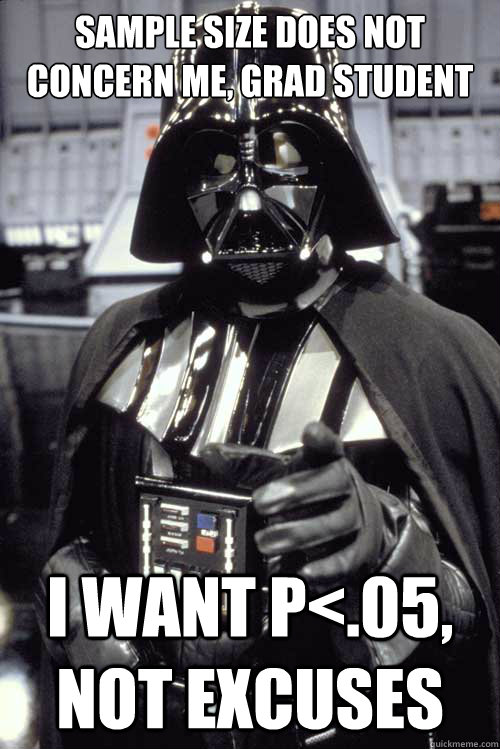

```{r setup, include=FALSE}
librarian::shelf(rlernen)
tutorial_setup()
librarian::shelf(WebPower, ppcor)
# leads to problems
#knitr::opts_chunk$set(cache = TRUE)

# Daten für Gutachter-Aufgabe
a <- c(19, 27, 9, 13, 8, 27)
b <- c(25, 26, 24, 15, 9, 4)
gutachter <- matrix(a+b, nrow=2, byrow=T)
colnames(gutachter) <- c("Plant Relocation", "Tax evasion", "Independence")
gutachter <- as.data.frame(gutachter, row.names = c("Recognize", "Do not recognize"))
gutachter

# Daten für Simpsons Paradox
a <- c(820, 80, 680, 20)
b <- c(20, 80, 100, 200)
simpsonsparadox <- matrix(a+b, nrow=2, byrow=T)
colnames(simpsonsparadox) <- c("Accept", "Reject")
simpsonsparadox <- as.data.frame(simpsonsparadox, row.names = c("Male", "Female"))
simpsonsparadox

# Daten für U-Test
solved_female <- c(24, 20, 18, 17, 15, 15, 14, 14, 14, 13, 13, 11, 11, 10, 9, 
                   9, 8, 8, 8, 8, 8, 8, 8, 7, 7, 7, 7, 7, 4, 4)
solved_male <- c(22, 21, 21, 21, 19, 19, 17, 17, 17, 17, 17, 18, 16, 16, 16,
                 15, 15, 15, 15, 13, 13, 13, 12, 11, 11, 11, 10, 10, 8, 5)

# Daten für Partialkorrelation Vorlesung
vl <- matrix(c(1, .43, -.51, -.54, .43, 1, .41, -.12, -.51, .41, 1, .23, -.54, -.12, .23, 1), ncol = 4)
row.names(vl) <- c("Gewichtsverlust", "Sport", "Kalorienaufnahme", "Alter")
colnames(vl) <- c("Gewichtsverlust", "Sport", "Kalorienaufnahme", "Alter")
vl

# Daten für Wilcoxon-Test
gewicht_t1 <- c(58, 55, 60, 52, 53, 53, 55, 49, 50, 55)
gewicht_t2 <- c(61, 60, 64, 56, 59, 60, 59, 47, 52, 56)

d <- readRDS("data/students.rds")
d <- d[d$geschlecht %in% c("weiblich", "männlich"),]
```

## Hinweise

Eine R-Nutzerin, die bereits vorher einen R-Kurs belegt hat, bewertete dieses Tutorial insgesamt mit einer Schwierigkeit von 6 (0:sehr leicht, 10:sehr schwer). Sie brauchte für dieses Tutorial ungefähr 1h10min. Klicke auf "Nächstes Kapitel" und es geht los.

## Einführung

Leider musst Du Dich heute noch weiter mit statistischen Tests beschäftigen, genauer gesagt nonparametrischen Tests. Diese verwenden wir, wenn die untersuchten Variablen kein Intervallskalenniveau haben oder die Voraussetzungen für einen statistischen Test nicht erfüllt sind (z. B. keine Normalverteilung in der Population). Dazu gibt es zwei Dinge zu sagen: (1) in der Psychologie wird das Intervallskalenniveau so gut wie nie erreicht -- die Psychologen tun aber gerne trotzdem so als ob, sie "spielen" Intervallskalenniveau. (2) Bootstrapping und Permutationstests wären eigentlich die bessere Alternative um das Problem zu lösen, werden aber erst im Masterstudium ausführlich behandelt.

Man könnte vermuten, dass es keinen guten Grund gibt statistische Tests so zu lernen wie wir das gerade tun. Stattdessen könnte man direkt mit Bootstrapping anfangen und hätte die komplette Inferenzstatistik in 2-3 Vorlesungen abgehandelt und alles unter dem Hut eines einzigen Konzepts, statt einem Dutzend verschiedener Tests. Warum tun wir das (noch) nicht? Weil in der Literatur immer noch die klassischen Tests verwendet werden und Du für Dein empirisch-experimentelles Praktikum und Deine Abschlussarbeit die Literatur lesen und verstehen musst.

Da es also wieder etwas trocken wird, hab ich als kleinen Höhepunkt die Poweranalyse in dieser Sitzung integriert. Außerdem schauen wir uns auch kurz die Lowess-Kurve und Partialkorrelationen an. Diese Themen sind etwas willkürlich gewählt, aber für eine Erfrischung gut geeignet.

Wir verwenden übrigens wieder die Vorlesungsdaten:

```{r, eval=FALSE, echo = TRUE}
d <- readRDS("data/students.rds")
```

```{r, echo = TRUE}
d
```

## Nonparametrische Tests

### $\chi^2$-Test

Wir stellen uns am Anfang eine wichtige Frage: Ist die Ernährungsweise unabhängig vom Geschlecht? Genau solche Fragen lassen sich gut mit einem $\chi^2$-Test auf Unabhängigkeit untersuchen.

```{r, chisq-demo, echo = TRUE}
result <- chisq.test(d$geschlecht, d$vegetarier)
result
result$observed
```

Im Output sehen wir zunächst das Testergebnis und darunter die beobachteten Häufigkeiten. Der Test prüft hier, ob Geschlecht und Ernährungsweise statistisch unabhängig voneinander sind.

Bei $2\times2$-Tabellen verwendet `chisq.test()` standardmäßig eine Yates-Korrektur. Das ist wichtig, wenn Du den Test per Hand nachrechnen oder aus dem $\chi^2$-Wert eine Effektgröße ableiten möchtest.

Wenn wir den korrigierten $\chi^2$-Wert direkt verwenden, unterschätzen wir die Effektgröße $\Phi$ bzw. $w$.

```{r chisq-effect, echo = TRUE}
sqrt(3.9077 / 107)
```

Für eine $2\times2$-Tabelle gilt:
- $\Phi = \sqrt{\chi^2 / N}$
- bei $2\times2$-Tabellen ist $\Phi$ zugleich identisch mit $w$

Um die passende Effektgröße aus dem Testwert zu berechnen, schalten wir die Yates-Korrektur aus:

```{r chisq-correct, echo = TRUE}
chisq.test(d$geschlecht, d$vegetarier, correct = FALSE)
```

Und nun passt die Formel:

```{r chisq-correct-effect, echo = TRUE}
sqrt(5.0244 / 107)
```

Zum Vergleich kann man bei einer $2\times2$-Tabelle auch die Korrelation der numerisch kodierten Variablen betrachten:

```{r chisq-actual-effect, echo = TRUE}
cor(as.numeric(as.factor(d$geschlecht)),
    as.numeric(as.factor(d$vegetarier)))
```

Die Richtung des Korrelationskoeffizienten hängt hier von der gewählten Kodierung ab. Für die Stärke des Zusammenhangs ist deshalb vor allem der Betrag interessant.

Wichtig:
- Die direkte Interpretation über $\Phi$ funktioniert nur bei $2\times2$-Tabellen.
- Bei größeren Kreuztabellen braucht man andere Effektgrößen, z. B. Cramérs $V$.

Jetzt bist Du dran. In der Übung zur Methodenlehre haben wir aus einem Artikel folgende Tabelle extrahiert:

```{r prepare-tax-data, echo = TRUE}
a <- c(19, 27, 9, 13, 8, 27)
b <- c(25, 26, 24, 15, 9, 4)
gutachter <- matrix(a + b, nrow = 2, byrow = TRUE)
colnames(gutachter) <- c("Plant Relocation", "Tax evasion", "Independence")
gutachter <- as.data.frame(gutachter, row.names = c("Recognize", "Do not recognize"))
gutachter
```

Es ging um die Frage, ob Gutachter ethische Probleme in Finanz-Anträgen identifizieren können. Es gibt drei Szenarien (in den Spalten) und als AV wurde erfasst, ob das Problem erkannt wurde oder nicht.

Die Frage ist also: Gibt es Unterschiede in der Erkennungsrate zwischen den drei Szenarien?

Als $\chi^2$-Wert kam im Paper ungefähr 8.6 heraus. Prüfe diesen Wert nach:

```{r chisq, exercise=TRUE}

```

```{r chisq-solution}
chisq.test(gutachter)
```

```{r chisq-mpc, echo=FALSE}
q_n(0.0138, "Wie groß ist der $p$-Wert? (gerundet auf 4 Dezimalstellen)")
```

```{r chisq-mpc2, echo=FALSE}
question("Wäre es hier möglich, die Effektgröße $\\Phi$ zu berechnen?",
  answer("Nein, das geht nur bei $2\\times2$-Tabellen.", correct = TRUE),
  answer("Ja, und der Effekt wäre ungefähr 0.20."),
  answer("Ja, und der Effekt wäre ungefähr -0.20."),
  answer("Nein, da der $\\chi^2$-Wert eine Korrektur enthält."),
  answer("Nein, denn das Ergebnis ist nicht signifikant."),
  random_answer_order = TRUE
)
```

### $U$-Test / Wilcoxon-Rangsummentest

Die Namensgebung bei diesem Test ist leider etwas verwirrend. Gemeint ist immer derselbe Grundtest für **zwei unabhängige Stichproben**, aber je nach Buch oder Software heißt er unterschiedlich:

- Mann-Whitney-$U$-Test
- Wilcoxon-Rangsummentest
- Wilcoxon rank-sum test
- Mann-Whitney-Wilcoxon-Test

In `R` läuft dieser Test über `wilcox.test()` mit `paired = FALSE` (das ist der Default). In R wird bei `wilcox.test(..., paired = FALSE)` die Teststatistik als $W$ ausgegeben; in der Vorlesung haben wir denselben Test meist über die Statistik $U$ kennengelernt.

Wir haben an Tag 4 einen $t$-Test gerechnet, um zu prüfen, ob sich die Körpergröße zwischen Männern und Frauen unterscheidet. Wenn die Voraussetzungen für den $t$-Test fraglich sind, kann man hier stattdessen einen nichtparametrischen Test verwenden:

```{r u-demo, echo = TRUE}
m <- d[d$geschlecht == "männlich", "groesse"]
w <- d[d$geschlecht == "weiblich", "groesse"]

wilcox.test(m, w, paired = FALSE)
```

Du kannst `paired = FALSE` auch weglassen, weil das bereits die Standardeinstellung ist:

```{r u-demo-default, echo = TRUE}
wilcox.test(m, w)
```

Wichtig für die Einordnung:
- `wilcox.test(x, y, paired = FALSE)` = Test für **unabhängige** Stichproben
- `wilcox.test(x, y, paired = TRUE)` = Wilcoxon-Test für **abhängige** Stichproben

Im Output sieht man außerdem, dass häufig eine Korrektur verwendet wird. Wenn Du Ergebnisse mit einer Handrechnung vergleichen willst, solltest Du deshalb darauf achten, ob diese Korrektur ein- oder ausgeschaltet ist. In der Vorlesung rechnen wir meist ohne Korrektur nach.

In der Übung haben wir uns ein Paper angeschaut, bei dem es um die Frage ging, ob Frauen und Männer in unterschiedlichen Umwelten (friedlich oder kompetitiv) besser oder schlechter performen. Im Folgenden findest Du die Anzahl der gelösten Aufgaben:

```{r prepare-gneezy, echo = TRUE}
solved_female <- c(24, 20, 18, 17, 15, 15, 14, 14, 14, 13, 13, 11, 11, 10, 9, 
                   9, 8, 8, 8, 8, 8, 8, 8, 7, 7, 7, 7, 7, 4, 4)
solved_male <- c(22, 21, 21, 21, 19, 19, 17, 17, 17, 17, 17, 18, 16, 16, 16,
                 15, 15, 15, 15, 13, 13, 13, 12, 11, 11, 11, 10, 10, 8, 5)
```

Rechne den Test für den Vergleich zwischen Männern und Frauen. Schalte hier die Korrektur aus, sodass derselbe Wert herauskommt wie bei der Berechnung per Hand in der Übung.

```{r utest, exercise=TRUE}

```

```{r utest-solution}
wilcox.test(solved_female, solved_male, correct = FALSE)
```

```{r utest-mpc, echo=FALSE}
q_n(211.5, "Wie groß ist der $U$-Wert (ohne Korrektur)?")
```

### Wilcoxon-Test (signed-rank) für abhängige Stichproben

Für abhängige Stichproben verwendet `wilcox.test()` denselben Funktionsnamen, aber diesmal mit `paired = TRUE`. Dann handelt es sich um den Wilcoxon signed-rank test.

Wir haben an Tag 4 auch einen $t$-Test gerechnet, um zu prüfen, ob sich die Deutsch- und Mathepunkte unterscheiden. Wenn die Voraussetzungen für einen gepaarten $t$-Test fraglich sind, kann man hier als Alternative den Wilcoxon-Test für abhängige Stichproben verwenden:

```{r wilcox-demo, echo = TRUE}
wilcox.test(d$mathe, d$deutsch, paired = TRUE)
```

Die Teststatistik heißt im Output $V$. In vielen Lehrbüchern wird hier eine andere Notation verwendet. Wichtig ist vor allem, dass dies die Version für **abhängige** Stichproben ist.

Zum Vergleich können wir uns den gepaarten $t$-Test dazu anschauen:

```{r wilcox-diff-t-test, echo = TRUE}
t.test(d$mathe, d$deutsch, paired = TRUE)
```

Hier unterscheiden sich die $p$-Werte merklich. Das ist nicht immer so, aber es zeigt, dass die Wahl des Tests einen Unterschied machen kann. Deshalb sollte man sich immer überlegen, welches Skalenniveau vorliegt und ob die Voraussetzungen eines parametrischen Tests plausibel sind.

Interessant ist außerdem der Vergleich mit der falschen Modellierung als **unabhängige** Stichproben:

```{r wilcox-diff-independent, echo = TRUE}
wilcox.test(d$mathe, d$deutsch, paired = FALSE)
```

Der Unterschied ist deutlich. Genau deshalb ist es wichtig, abhängige Daten auch wirklich als abhängig zu behandeln. Umgekehrt wäre es ebenso falsch, unabhängige Daten als abhängig zu analysieren.

Zur Erinnerung:
- `paired = TRUE` → abhängige Stichproben
- `paired = FALSE` → unabhängige Stichproben

In der Übung hatten wir ebenfalls einen Wilcoxon-Test gerechnet. Es ging um eine neue Therapieform bei Anorexie-Patienten. Gemessen wurde das Körpergewicht in kg vor und nach der Therapie. Die Daten waren:

```{r prepare-uebung-wilcox, echo = TRUE}
gewicht_t1 <- c(58, 55, 60, 52, 53, 53, 55, 49, 50, 55)
gewicht_t2 <- c(61, 60, 64, 56, 59, 60, 59, 47, 52, 56)
```

Prüfe nach, ob Du auf dasselbe Ergebnis kommst wie in der Übung. Wir haben einseitig getestet, und zwar auf eine Erhöhung des Gewichts. Schalte auch hier die Korrektur aus.

```{r wilcox, exercise=TRUE}

```

```{r wilcox-solution}
wilcox.test(gewicht_t2, gewicht_t1, paired = TRUE, alternative = "greater", correct = FALSE)
```

```{r wilcox-mpc, echo=FALSE}
q_n(52.5, "Wie groß ist der $T$-Wert (ohne Korrektur)?")
```

Sehr gut! Jetzt haben wir wirklich alle Signifikanztests der Vorlesung behandelt. Ich hoffe, ich habe nichts vergessen.

Das war harte Arbeit, und jetzt kommt die Belohnung: Poweranalyse. Klingt vielleicht erst einmal nach noch mehr Arbeit, aber wenn man die Grundidee verstanden hat, ist sie sehr nützlich.

## Power-Analyse

Mit einer Power-Analyse kann man entweder die nötige Stichprobengröße für eine gewünschte Power bestimmen oder die Power für eine bereits geplante Stichprobengröße berechnen.

Wir verwenden dafür das Paket `WebPower`. Falls es noch nicht installiert ist:

```{r eval=FALSE, echo = TRUE}
install.packages("WebPower")
```

Eine hilfreiche Faustregel ist: In `WebPower` lässt man meistens genau den Wert weg, den man berechnen möchte.

### Beispiel: Poweranalyse für Korrelationen

Hier sind Effektgröße, gewünschte Power und Alternativhypothese vorgegeben. Gesucht ist also die Stichprobengröße `n`:

```{r, echo = TRUE}
wp.correlation(r = .3, power = .8, alternative = "greater")
wp.correlation(r = .3, power = .8, alternative = "two.sided")
```

Wir geben also die Effektgröße, die gewünschte Power und die Alternativhypothese (einseitig, zweiseitig) an und bekommen die benötigte Stichprobengröße heraus.

Diese Logik funktioniert auch für andere Tests. Zum Beispiel für den $t$-Test:

```{r, echo = TRUE}
wp.t(d = 0.5, power = .9, type = "two.sample")
```

Auch hier fehlt `n`, also berechnet `WebPower` die nötige Stichprobengröße.

### Beispiel: Poweranalyse für ANOVA

Für `wp.anova()` brauchen wir Cohen’s $f$ und nicht $\eta^2$. Deshalb müssen wir die Effektgröße zuerst umrechnen:

```{r, echo = TRUE}
eta_squared <- .1
f <- sqrt(eta_squared / (1 - eta_squared))
wp.anova(k = 3, power = .7, f = f)
```

Dabei ist `k` die Anzahl der Gruppen. Da `n` wieder fehlt, berechnet `WebPower` auch hier die nötige Stichprobengröße.

Okay, dann kannst Du jetzt mal ein bisschen üben:

Hier ist eine Tabelle für die Power von ANOVAs, es hat sich jedoch ein Fehler eingeschlichen:

| n   | $\eta^2_p = 0.01$ | $\eta^2_p = 0.06$ | $\eta^2_p = 0.14$ |
|-----:|------:|------:|------:|
| 10  | 0.09 | 0.34 | 0.69 |
| 20  | 0.14 | 0.60 | 0.94 |
| 30  | 0.19 | 0.78 | 0.99 |
| 40  | 0.25 | 0.88 | \*   |
| 50  | 0.29 | 0.94 | \*   |

Prüfe die Werte nach für ein $2\times2$-Design und $\eta^2 = 0.06$.

Gehe in zwei Schritten vor:
1. Rechne $\eta^2 = 0.06$ in Cohen’s $f$ um.
2. Berechne die Power für 30, 40 und 50 Personen **pro Gruppe**.

**Wichtige Hinweise:**
- Ein $2\times2$-Design hat insgesamt 4 Gruppen.
- In der Tabelle ist die Stichprobengröße **pro Gruppe** angegeben.
- `wp.kanova()` erwartet aber die **Gesamtstichprobengröße** `n`.
- Für einen Haupteffekt in einem $2\times2$-Design gilt hier `ndf = 1`.
- `ng` gibt die Anzahl der Gruppen an.

In der Vorlesung sind die Power-Werte für 30, 40 und 50 Personen pro Gruppe als 0.78, 0.88 und 0.94 angegeben.

```{r powervorlesung, exercise=TRUE}

```

```{r powervorlesung-solution}
eta_squared <- .06
f <- sqrt(eta_squared / (1 - eta_squared))

wp.kanova(n = 120, ndf = 1, f = f, ng = 4)
wp.kanova(n = 160, ndf = 1, f = f, ng = 4)
wp.kanova(n = 200, ndf = 1, f = f, ng = 4)
```

```{r powervorlesung-mpc, echo=FALSE}
question("Für welche Stichprobengröße (pro Gruppe) wurde die Power in der Vorlesung anscheinend falsch gerundet?",
         answer("40", correct = TRUE),
         answer("30"),
         answer("50"),
         answer("Alle Werte sind korrekt gerundet."),
         answer("Keiner der Werte ist korrekt gerundet."),
         random_answer_order = TRUE)
```

```{r powervorlesung-mpc2, echo=FALSE}
question("Warum könnte die Ungenauigkeit aus der letzten Aufgabe gewollt sein?",
         answer("Die Power wird so nicht überschätzt.", correct = TRUE),
         answer("Die Power wird so nicht unterschätzt."),
         answer("Eine kleinere Power ist für den Forscher wünschenswert."),
         answer("Die Angabe ohne Kommastellen ist komfortabler."),
         answer("Rundungsfehler gleichen andere Arten von Fehler (z. B. Messfehler) zufällig wieder aus."),
         random_answer_order = TRUE)
```

Du planst eine eigene Studie und gehst von einem Effekt von $d = 0.6$ aus. Das $\alpha$-Niveau legst Du auf 0.10 fest. Du möchtest wissen, wie groß die Power Deiner Studie in Abhängigkeit der Stichprobengröße ist.

Gehe dabei in drei Schritten vor:
1. Erzeuge mit `seq(10, 500, 10)` Stichprobengrößen von 10 bis 500 in 10er-Schritten.
2. Berechne mit `wp.t()` für diese Werte die jeweilige Power.
3. Erstelle mit `plot()` eine Abbildung mit der Stichprobengröße auf der $x$-Achse und der Power auf der $y$-Achse.

**Hinweis:** Das Ergebnis von `wp.t()` ist ein Objekt, aus dem Du unter anderem `n` und `power` auslesen kannst.

```{r powerstudie, exercise=TRUE}

```

```{r powerstudie-solution}
power <- wp.t(
  d = 0.6,
  n1 = seq(10, 500, 10),
  type = "two.sample",
  alpha = .10
)

plot(power$n, power$power, type = "b",
     xlab = "Stichprobengröße",
     ylab = "Power")
```

```{r powerstudie-mpc, echo=FALSE}
question("Wie steigt/fällt die Power in Abhängigkeit der Stichprobengröße?",
         answer("Mit steigender Stichprobengröße nimmt die Power zu, aber die Zuwächse werden immer kleiner.", correct = TRUE),
         answer("Mit steigender Stichprobengröße nimmt die Power ab, aber die Abnahmen werden immer kleiner."),
         answer("Mit steigender Stichprobengröße nimmt die Power ab und die Abnahmen werden immer größer."),
         answer("Mit steigender Stichprobengröße nimmt die Power zu und die Zuwächse werden immer größer."),
         random_answer_order = TRUE)
```

Die Kurve steigt also nicht linear an: Anfangs bringt zusätzliche Stichprobengröße viel, später werden die Zugewinne kleiner.

Nicht schlecht! Spürst Du jetzt die Power der Power-Analyse?

{width=400}

Für heute bleiben uns noch zwei kleine Themen, die irgendwie nirgends richtig dazugehören: die Lowess-Kurve und die Partialkorrelation.

## Zwei Extra-Tools

### Lowess-Kurve

Wir schauen uns noch einmal den Zusammenhang zwischen den Mathe- und Deutschpunkten an, diesmal aber nicht nur über einen einzelnen Korrelationswert, sondern als Verlauf über den gesamten Wertebereich.

Eine Korrelation fasst einen Zusammenhang mit einer einzigen Zahl zusammen. Eine Lowess-Kurve hilft dagegen dabei zu sehen, **wie** der Zusammenhang über verschiedene Bereiche der Daten verläuft. Das ist besonders nützlich, wenn der Zusammenhang möglicherweise nicht streng linear ist.

Als Grundlage verwenden wir wieder einen Plot der einzelnen Beobachtungen. Da einige Werte mehrfach vorkommen, eignet sich hier ein `sunflowerplot()`:

```{r, echo = TRUE}
sunflowerplot(d$mathe, d$deutsch)
lines(lowess(x = d$mathe, y = d$deutsch))
```

Die Lowess-Kurve glättet den Verlauf der Daten lokal. Standardmäßig wird dabei `f = 2/3` verwendet. Je kleiner `f` ist, desto stärker folgt die Kurve lokalen Schwankungen und desto „zackiger“ wird sie.

Zum Vergleich können wir verschiedene Werte für `f` einzeichnen:

```{r, echo = TRUE}
sunflowerplot(d$mathe, d$deutsch)
lines(lowess(x = d$mathe, y = d$deutsch))
lines(lowess(x = d$mathe, y = d$deutsch, f = 0.2), col = "green")
lines(lowess(x = d$mathe, y = d$deutsch, f = 0.1), col = "blue")
```

Hier sieht man gut: Eine kleinere Glättung macht die Kurve beweglicher, aber auch unruhiger. Für einen ersten Überblick ist der Standardwert oft sinnvoll.

Erstelle nun einen Plot für den Zusammenhang zwischen dem Mögen von Hunden ($x$-Achse) und dem Mögen von Katzen ($y$-Achse) mit einer Lowess-Kurve (`f = 2/3`). Die Variablen heißen `hunde_m` und `katzen_m`.

```{r lowess, exercise=TRUE}

```

```{r lowess-solution}
sunflowerplot(d$hunde_m, d$katzen_m)
lines(lowess(x = d$hunde_m, y = d$katzen_m))
```

```{r lowess-mpc, echo=FALSE}
question("Wie lässt sich der Zusammenhang zwischen dem Mögen von Hunden und Katzen beschreiben?",
         answer("Bis zu einem mittleren Niveau ist der Anstieg positiv und fällt dann wieder leicht ab.", correct = TRUE),
         answer("Der Zusammenhang ist positiv und linear."),
         answer("Der Zusammenhang ist negativ und linear."),
         answer("Bis zu einem mittleren Niveau ist der Anstieg negativ und steigt dann wieder leicht an."),
         random_answer_order = TRUE)
```

Die Lowess-Kurve ist also eine gute Ergänzung zur Korrelation: Während die Korrelation den linearen Zusammenhang in einer Zahl zusammenfasst, hilft die Kurve dabei zu prüfen, ob der Verlauf möglicherweise gekrümmt oder in verschiedenen Bereichen unterschiedlich stark ist.

### Partialkorrelation

Eine Partialkorrelation misst den Zusammenhang zwischen zwei Variablen, nachdem der Einfluss einer dritten Variablen herausgerechnet wurde. Man untersucht also nicht einfach den Rohzusammenhang, sondern den Zusammenhang **unter Konstanthaltung** einer weiteren Variable.

Wir verwenden dafür die Funktion `pcor.test()` aus dem Paket `ppcor`.

Falls das Paket noch nicht installiert ist:

```{r, eval=FALSE, echo = TRUE}
install.packages("ppcor")
```

#### IQ-Beispiel

Stell Dir vor, wir haben den Gesamt-IQ und die Ergebnisse eines verbalen und eines numerischen Tests von 10 Personen vorliegen. Wir wollen nun wissen, wie stark der Zusammenhang zwischen verbalem und numerischem Test ist, wenn wir den Einfluss des IQ herausrechnen.

```{r, echo = TRUE}
verb_test <- c(4, 5, 6, 7, 8, 10, 11, 12, 14, 15)
num_test  <- c(5, 6.5, 7, 5.5, 9, 6.5, 8, 10.5, 8, 10)
iq        <- c(98, 98, 103, 101, 100, 106, 111, 125, 120, 115)

pcor.test(verb_test, num_test, iq)
```

Hier wird der IQ aus dem Zusammenhang zwischen verbalem und numerischem Test herauspartialisiert.

#### Übungsaufgabe

Berechne nun die Partialkorrelation zwischen Deutsch- und Mathepunkten **ohne den Einfluss der Abiturnote**.

Gehe am besten in zwei Schritten vor:
1. Berechne zunächst die normale Korrelation zwischen Deutsch- und Mathepunkten.
2. Berechne danach die Partialkorrelation unter Kontrolle der Abiturnote.

So kannst Du die beiden Werte direkt miteinander vergleichen.

```{r partial, exercise=TRUE}

```

```{r partial-solution}
cor.test(d$deutsch, d$mathe)
ppcor::pcor.test(d$deutsch, d$mathe, d$abi)
```

```{r partial-mpc, echo=FALSE}
question("Im Vergleich zur normalen Korrelation, wie groß ist die Partialkorrelation?",
         answer("Ungefähr halb so groß.", correct = TRUE),
         answer("Ungefähr doppelt so groß."),
         answer("Ungefähr gleich groß."),
         answer("Ungefähr ein Drittel so groß."),
         answer("Ungefähr ein Viertel so groß."),
         random_answer_order = TRUE)
```

Wichtig ist dabei die Interpretation: Wenn die Partialkorrelation deutlich kleiner ist als die normale Korrelation, dann erklärt die herauspartialisierte Variable einen Teil des ursprünglichen Zusammenhangs mit.

### Eigene Funktion für Partialkorrelation

Schreibe nun eine eigene Funktion, mit der Du aus drei Korrelationen eine Partialkorrelation berechnen kannst.

Die Formel lautet:

$$
r_{xy.z} = \frac{r_{xy} - r_{xz}r_{yz}}{\sqrt{1-r_{xz}^2}\sqrt{1-r_{yz}^2}}
$$

Dabei gilt:
- $r_{xy}$: Korrelation zwischen $x$ und $y$
- $r_{xz}$: Korrelation zwischen $x$ und $z$
- $r_{yz}$: Korrelation zwischen $y$ und $z$

Verwende die Funktion anschließend für folgendes Beispiel:

```{r, echo = TRUE}
vl <- matrix(c(1, .43, -.51, -.54,
               .43, 1, .41, -.12,
               -.51, .41, 1, .23,
               -.54, -.12, .23, 1), ncol = 4)
row.names(vl) <- c("Gewichtsverlust", "Sport", "Kalorienaufnahme", "Alter")
colnames(vl) <- c("Gewichtsverlust", "Sport", "Kalorienaufnahme", "Alter")
vl
```

Gesucht ist der Zusammenhang zwischen **Gewichtsverlust** und **Sport**, **ohne den Einfluss der Kalorienaufnahme**.

Gehe dabei in zwei Schritten vor:
1. Schreibe eine Funktion `parcor(xy, xz, yz)`.
2. Setze anschließend die passenden Korrelationen aus der Matrix `vl` in die Funktion ein.

**Hinweis:** Du brauchst hier die drei Korrelationen
- zwischen Gewichtsverlust und Sport,
- zwischen Gewichtsverlust und Kalorienaufnahme,
- zwischen Sport und Kalorienaufnahme.

```{r parcor2, exercise=TRUE}

```

```{r parcor2-solution}
parcor <- function(xy, xz, yz) {
  (xy - xz * yz) / (sqrt(1 - xz^2) * sqrt(1 - yz^2))
}

parcor(vl[1, 2], vl[1, 3], vl[2, 3])
```

```{r parcor2-mpc, echo=FALSE}
q_n(0.8146, "Wie groß ist die Korrelation? (gerundet auf 4 Dezimalstellen)")
```

Diese Aufgabe ist etwas anspruchsvoller, aber sie zeigt sehr schön, dass eine Partialkorrelation kein Hexenwerk ist.

## Übungsaufgaben Tag 5

### Aufgabe $\chi^2$-Test

Die folgenden Daten sind aus einer Übungsaufgabe der Methodenlehre zum Simpsons Paradox.

```{r prepare-simpsons-paradox, echo = TRUE}
a <- c(820, 80, 680, 20)
b <- c(20, 80, 100, 200)
simpsonsparadox <- matrix(a+b, nrow=2, byrow=T)
colnames(simpsonsparadox) <- c("Accept", "Reject")
simpsonsparadox <- as.data.frame(simpsonsparadox, row.names = c("Male", "Female"))
simpsonsparadox
```

Dargestellt sind hier die Häufigkeiten der Annahme und Ablehnung von Studienplatzbewerbungen aufgeteilt nach Geschlecht. Wir haben in der Übung den $p$-Wert aus dem Artikel von Kievit hierzu nachgerechnet. Das haben wir per Hand gemacht, also ohne Yates Korrektur und kamen auf einen Wert von 11.696. Welcher Wert kommt in `R` (mit Korrektur) heraus?

```{r simpson, exercise=TRUE}

```

```{r simpson-solution}
chisq.test(simpsonsparadox, correct = TRUE)
```

```{r simpson-mpc, echo=FALSE}
q_n(11.309, "Welcher $\\chi^2$-Wert kommt heraus? (gerundet auf 3 Dezimalstellen)")
```

Das ist auch der Wert, der im Paper angegeben ist.

### Aufgabe Power

Wie groß ist die Power bei einer Regression mit zwei Prädiktoren, einer Stichprobengröße von 88, einem $\alpha$ von 5% und einem $R^2$ von 0.13? Benutze die Funktion `wp.regression` und finde heraus, wie Du $R^2$ in $f^2$ umrechnen kannst.

```{r powervl2, exercise=TRUE}
```

```{r powervl2-solution}
f2 = 0.13 / (1 - 0.13)
wp.regression(n = 88, p1 = 2, f2 = f2, alpha = .05)
```

```{r powervl2-mpc, echo=FALSE}
q_n(0.9, "Wie groß ist die Power? (gerundet auf 2 Dezimalstellen)")
```

Gut gemacht. Du hast diesen Tag erfolgreich überstanden. Nur noch zwei Tage, dann bist Du ein R-Profi!
