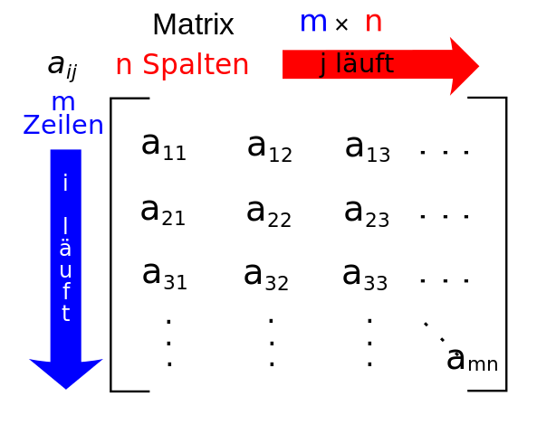
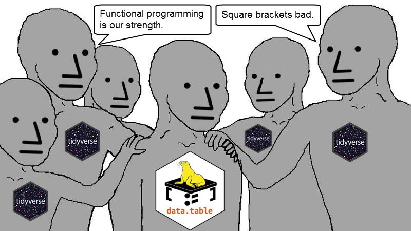

```{r setup, include=FALSE}
source("setup.R")
# slows down substantially 
#knitr::opts_chunk$set(cache = TRUE)

#--------extra libs
librarian::shelf(psych)

#--------data
data <- readRDS("data/pizza.rds")
imdb <- readRDS("data/imdb.rds")
imdb_top <- imdb[imdb$imdb_score >= 8.9 & 
                 imdb$num_voted_users >= 10000 & 
                 !(imdb$duration <= 60),
                 c("movie_title", "imdb_score", "num_voted_users")]
starwars <- readRDS("data/starwars.rds")
```


## Hinweise

Eine R-Nutzerin, die bereits vorher einen R-Kurs belegt hat, bewertete dieses Tutorial insgesamt mit einer Schwierigkeit von 7.5 (0=sehr leicht, 10=sehr schwer). Die besonders schweren Aufgaben sind nochmals separat gekennzeichnet. Sie brauchte für dieses Tutorial ungefähr 2h 15min. Klicke auf "Nächstes Kapitel" und es geht los.

## Selektieren

Unser Pizza-Datensatz vom ersten Tag ist mit drei Pizzen recht langweilig, aber wir können uns auch mal alle Pizzen der Pizzeria anschauen, die ich unter `data` als `pizzen_komplett` gespeichert habe:

```{r echo=TRUE, eval = TRUE}
data <- read.csv("data/pizzen_komplett.csv")
data
```

Eine Menge Daten, an denen wir uns nun auslassen können. Bei fast jeder statistischen Analyse ist man gezwungen bestimmte Fälle und Variablen zu selektieren. Im einfachsten Fall ist das ähnlich zu einem Matrix-Index. Falls Du Dich mit Matrizen noch nicht auskennst, ist das nicht schlimm, hier ein Primer:

{width=250px}

<br>Im Grunde ist eine Matrix eine Art Tabelle, in der Zahlen drin stehen, ganz ähnlich zum Dataframe.

Sagen wir mal, wir möchten vom Pizza-Datensatz gerne Zeile 10, Spalte 2 (der Preis der Diavolo Pizza, 8.0). In Matrix-Index-Notation wäre dies $\mathrm{data}_{10,2}$ und in R fast genau so:

```{r echo=TRUE}
data[10, 2]
```

Einziger Unterschied ist, dass wir hier die eckigen Klammern ``[]`` benutzen müssen. Im Grunde sind diese Klammern auch wieder nur eine Funktion, aber mit einer speziellen Syntax. Die Klammern stehen hinter dem Objekt, auf welches eine Selektion angewandt werden soll. Die erste Zahl nach dem ``[`` selektiert die Zeile, dann kommt ein Komma, gefolgt von der Spalte, die selektiert werden soll. Das ganze wird dann mit ``]`` wieder geschlossen.

Wähle Zeile 20, Spalte 4 von **data** aus.

```{r selektion1, exercise = TRUE}

```

```{r selektion1-solution}
data[20, 4]
```

```{r selektion1mpc, echo=FALSE}
question(
  "Welcher Wert kommt heraus?",
  answer(as.character(data[20, 4]), correct = T),
  answer("Mozarella"),
  answer("11.5"),
  answer("32"),
  answer(as.character(data[2, 4])),
  answer(as.character(data[1, 4])),
  random_answer_order = T
)
```

Tatsächlich sind die eckigen Klammern viel flexibler als der Matrix-Index, denn sie kommen auch mit Vektoren klar. Wollen wir die ersten und letzten 5 Zeilen auswählen, sowie Spalte 1 und 4, so schreiben wir:

```{r echo = TRUE}
data[c(1, 2, 3, 4, 5, 28, 29, 30, 31, 32), c(1, 4)]
```

Beachte die Nummerierung der Zeilen links (1-5 und 28-32). 

Wähle nun zur Übung **Zeile** 22, 14, 26, 18, 20 und **Spalte** 1, 3 und 4 aus:

```{r selektion2, exercise = TRUE}

```

```{r selektion2-solution}
data[c(22, 14, 26, 18, 20), c(1, 3, 4)]
```

```{r selektion2mpc, echo=FALSE}
q_n(2, "Wie oft kommt der Durchmesser 26 cm in der Auswahl vor?")
```

Negative Indices sind auch möglich. Wollen wir alle Zeilen außer die ersten 5 und alle Spalten außer Spalte 2, so nutzen wir das Minus-Zeichen ``-``, welches wir vor den Vektor setzen:

```{r echo = TRUE}
data[-c(1, 2, 3, 4, 5), -c(2)]
```

Nun Du! Wähle alle Zeilen aus, bis auf Zeilen 1 bis 20 und alle Spalten, bis auf 2 und 3. Benutze für die Zeilenauswahl den Operator `:`. Lies Dir notfalls die Hilfe zum Doppelpunkt-Operator durch: `help(":")` und Zeit zu sparen!

```{r selektion2a, exercise = TRUE}

```

```{r selektion2a-solution}
data[-c(1:20), -c(2, 3)]
```

```{r selektion2ampc, echo=FALSE}
question(
  "Welche Pizza steht ganz oben bei der Selektion?",
  answer("Cipolla", correct = T),
  answer("Primavera"),
  answer("Spinaci"),
  answer("Diavolo"),
  answer("Hawaii"),
  answer("Speciale"),
  random_answer_order = T
)
```

Um Spalten zu selektieren gibt es auch noch eine andere Möglichkeit. Wollen wir wieder die ersten und letzten 5 Zeilen haben und Spalte 1 und 4, so können wir die Spalten auch direkt benennen:

```{r echo = TRUE}
data[c(1:5, 28:32), c("name", "preis_pro_kubikcm")]
```

Diese Schreibweise ist länger aber sicherer, denn egal an welcher Stelle sich die Variablen **name** und **preis_pro_kubikcm** befinden, sie werden korrekt ausgewählt. Wenn wir Zahlen benutzen, passiert schneller mal ein Fehler. Beispielsweise könnten Spalte 3 und 4 in einem zweiten Datensatz vertauscht sein:

```{r echo = TRUE}
data2 <- data[, c(1, 2, 4, 3)]
data2
```

Die Selektion

```{r echo = TRUE}
data2[, c(1, 4)]
```

ist technisch korrekt, aber eigentlich wollten wir **preis_pro_kubikcm** als zweite Spalte, und nicht **durchmesser**. Wir müssen also in diesem Fall:

```{r echo = TRUE}
data2[, c(1, 3)]
```

schreiben, oder gleich:

```{r echo = TRUE}
data2[, c("name", "preis_pro_kubikcm")]
```

Was sowohl für **data** als auch **data2** klappt. Die Lektion: Man muss viel mehr aufpassen, wenn man mit Zahlen indexiert. Dafür sind Zahlen natürlich schneller hingeschrieben. Ich empfehle: Folge der Devise "safety first" und benutze lieber die Namen der Variablen statt die Spaltennummern. Wenn Du den Code später nochmal anschaust, ist er auch viel leichter zu lesen. Du weißt sofort, was **preis_pro_kubikcm** ist, aber was Spalte 4 ist, weißt Du sicher nicht mehr.

Wollen wir nur eine Spalte auswählen, so gibt es noch eine weitere Möglichkeit:

```{r echo = TRUE}
data$preis
```

Über das ``$``-Zeichen haben wir hier direkt eine Spalte angesprochen und bekommen somit einen Vektor. Werte von Vektoren lassen sich im Übrigen genau so selektieren wie Zeilen in einem Dataframe:

```{r echo = TRUE}
data$preis[c(2, 4, 6, 8, 10)]
```

Da es bei Vektoren eben nur eine Spalte gibt, muss man das Komma zwischen den eckigen Klammern weglassen! Schreibt man es hin, kommt ein Fehler. Das wird Dir bestimmt am Anfang oft passieren. Eine gute Übung um Fehlermeldungen richtig zu lesen:

```{r echo = TRUE, error = TRUE}
data$preis[c(2, 4, 6, 8, 10), ]
```

Kryptisch, oder? Eine hilfreiche Fehlermeldung wäre: "Dude, Du hast einen Vektor, tust aber so als hättest Du eine Matrix!". Dies würde allerdings andere Probleme nach sich ziehen, denn dann müsste man `R` viele Spezialfälle beibringen, jeder mit einem eigenen Fehler. Außerdem sieht der Computer nicht das offensichtliche, die Semantik, die der Mensch hineininterpretiert. Tatsächlich ist `R`s Fehlermeldung auf den Punkt technisch korrekt und man kann wenig an ihr aussetzen.

Üben wir nun mal die Selektion bei einem Vektor ohne Fehlermeldungen zu produzieren. Wähle die Spalte **durchmesser** aus und selektiere Zeilen 17 bis 23. Es gibt hier einige Varianten (siehe auch die nächste MPC-Aufgabe), probier also verschiedene Vorgehensweisen aus und entscheide, welche Dir am besten gefällt.

```{r selektion3, exercise = TRUE}

```

```{r selektion3-solution}
data$durchmesser[17:23]
# oder
data[17:23, "durchmesser"]
# oder etliche andere Varianten!
```

```{r selektion4, echo=FALSE}
question("Wie kannst Du die Variable *name* im Pizza-Datensatz auswählen? (Achtung, mehrere Antworten sind richtig!)",
  answer("data$name", correct = TRUE),
  answer("data[name]"),
  answer("data[, c[\"name\"]]"),
  answer("data[\"name\"]", correct = TRUE),
  answer("data[, \"name\"]", correct = T),
  answer("data[, c(\"name\")]", correct = T),
  answer("data[1, ]"),
  answer("data[, 1]", correct = TRUE),
  answer("data[, -c(2, 3, 4)]", correct = TRUE),
  random_answer_order = T
)
```

Nach der Auswahl einer Spalte können wir natürlich eine Funktion darauf anwenden. Zum Beispiel könnten wir den Mittelwert und die Standardabweichung des Preises berechnen:

```{r echo = TRUE}
mean(data$preis)
sd(data$preis)
```

Probier Du es nun mal. Berechne den Mittelwert für den Preis getrennt für die Durchmesser 26 und 32 cm. *Hinweis*: Zeilen 1-18 haben einen Durchmesser von 26 cm und Zeilen 19-36 einen Durchmesser von 32 cm. Runde das Ergebnis mit Hilfe von `round` auf 2 Dezimalstellen.

```{r selektion5, exercise = TRUE}

```

```{r selektion5-solution}
# 26 cm
round(mean(data$preis[1:18]), 2)
# 32 cm
round(mean(data$preis[19:36]), 2)
# Hinweis: es gibt natürlich auch andere Möglichkeiten
```

```{r selektion5mpc, echo=FALSE}
quiz(q_n(8.39, "Was ist der Mittelwert für die 26er Pizzen? (auf 2 Dezimalstellen gerundet)"),
     q_n(11.89, "Was ist der Mittelwert für die 32er Pizzen? (auf 2 Dezimalstellen gerundet)"))
```

Selektieren von Zeilen und Spalten ist ziemlich cool, aber in Staunen versetzen wirst Du damit höchstens Deine kleine Schwester, wohl kaum Deine Freunde. Dafür brauchst Du ein größeres Kaliber. Du greifst Dir die Filter-Flinte.

## Filtern

Filtern ist ein überaus wichtiges Thema. Daher bietet es sich an, zunächst verschiedene Möglichkeiten des Filterns theoretisch zu besprechen und erst dann intensiv zu üben. Der nächste Part ist also etwas trockener als die bisherigen (oder *noch* trockener?). Aber bleib am Ball, denn nach der Theorie bekommst Du einen abgefahrenen Datensatz, den Du richtig schön durchfiltern kannst.

### Theorie

Falls Du schon andere Statistiksoftware benutzt hast, kennst Du von dort eventuell die Funktion *Filtern*. Damit kannst Du logische Ausdrücke erzeugen um bestimmte Zeilen in einem Datensatz auszuwählen. Das ist in `R` genauso. Im Gegensatz zum normalen Selektieren, gibst Du beim Filtern also für jede Zeile an, ob sie ausgegeben werden soll oder nicht. Klingt kompliziert, ist aber ganz simpel. Ein Beispiel:

```{r echo = TRUE}
mein_filter <- c(rep(TRUE, 18), rep(FALSE, 18))
mein_filter
data$preis[mein_filter]
```

Zunächst erzeuge ich einen Filter, der aus 18 mal wahr und 18 mal falsch besteht. Heißt einfach, dass die ersten 18 Zeilen ausgegeben werden sollen, und die letzten 18 Zeilen nicht. Den Filter wende ich auf den Vektor Preis an und zu erkennen ist, dass hier nur kleine Preise vorkommen, also nur die Pizzen mit 26 cm Durchmesser (die ersten 18 Zeilen). An diesem Beispiel sieht man, dass das Filtern und Selektieren verwandt sind. Tatsächlich haben wir im vorherigen Abschnitt, die gleiche Funktionalität über ``data$preis[1:18]`` erzielt. Viel kürzer. Also warum sollten wir so einen merkwürdigen TRUE-FALSE-Filter benutzen? Die Antwort ist, dass logische Vektoren sehr leicht zu erzeugen und zu lesen sind. Der Filter von oben lässt sich nämlich so viel einfacher schreiben:

```{r echo = TRUE}
filter_durchmesser26 <- data$durchmesser == 26
data$preis[filter_durchmesser26]
```

Der entscheidende Part ist `data$durchmesser == 26`. Dieses Kommando erzeugt uns einen logischen Vektor (kann nur die Werte TRUE oder FALSE annehmen). Wenn die Bedingung stimmt, dass der Durchmesser gleich 26 ist, kommt wahr heraus, wenn es nicht stimmt, kommt falsch heraus. Man beachte die zwei Gleichheitszeichen ``==``. Du wirst Dich damit noch schön herumärgern, wenn Du aus Versehen nur ein Gleichheitszeichen benutzt und `R` anfängt Dich zu beschimpfen.

Etwas kürzer lässt sich der Filter auch ohne Zwischenschritt in einer Zeile schreiben:

```{r echo = TRUE}
data$preis[data$durchmesser == 26]
```

Und diese Zeile ist natürlich sehr schön zu lesen. Man weiß direkt was los ist. Wir wählen vom Preis nur die Elemente aus, bei denen der Durchmesser genau 26 cm ist.

Das war's schon mit dem Grundprinzip vom Filtern. Aber es gibt natürlich noch viele Erweiterungen. Zunächst ist wohl klar, dass Alternativen mit Auswahl der Spalte und jeglichen anderen Kombinationen möglich sind:

```{r echo = TRUE}
data[data$durchmesser == 26, ]
data[data$durchmesser == 32, c(1, 4)]
```

Auch ist es möglich Ungleichungen zu benutzen:

```{r echo = TRUE}
data[data$preis < 10, ]
```

Ein kleiner Test. Dein Freund aus Tag 1 wollte nicht mehr als 1.5 Cent pro Kubikzentimeter Pizza ausgeben. Welche Pizzen kommen für ihn in Frage? Erstelle für Deinen Freund eine gefilterte Speisekarte. *Hinweis*: finde zunächst das Zeichen für "kleiner gleich" heraus.

```{r filtern1, exercise = TRUE}

```

```{r filtern1-hint}
# "kleiner gleich" kannst Du in R einfach als <= schreiben.
```

```{r filtern1-solution}
data[data$preis_pro_kubikcm <= 0.015, ]
```

```{r filtern1-mpc, echo=FALSE}
question("Welche Pizzen kann Dein Freund sowohl mit Durchmesser 26 cm als auch 32 cm bestellen?",
  answer("Nur Margherita", correct = TRUE),
  answer("Margherita und Cipolla"),
  answer("Margherita und Prosciutto"),
  answer("Torita und Diavolo"),
  answer("Nur Salsicce"),
  random_answer_order = T
)
```

Filter lassen sich auch kombinieren. Sagen wir mal, Dein Freund hat gerade nur 11.5€ auf der Hand, gleichzeitig will er seine 1.5 Cent pro Kubikzentimeter einhalten:

```{r echo = TRUE}
data[data$preis <= 11.5 & data$preis_pro_kubikcm <= 0.015, ]
```

Das `&` ist hier das logische UND. Es gibt auch das logische ODER. Ich hätte gerne Pizzen die entweder einen Durchmesser von 26 cm haben oder einen Preis pro Kubikzentimeter von kleiner als 0.0145:

```{r echo = TRUE}
data[data$durchmesser == 26 | data$preis_pro_kubikcm < 0.0145, ]
```

Das `|` steht also für das logische ODER.

Als letztes gibt es  noch das logische NICHT, welches einfach nur den logischen Vektor umkehrt:

```{r echo = TRUE}
mein_filter <- data$preis_pro_kubikcm <= 0.015
mein_filter
# nun umkehren
!mein_filter
```

Um also alle Pizzen, bei denen der Preis pro Kubikzentimeter nicht weniger als 1.5 Cent ist, auszuwählen, kann ich folgendes schreiben:

```{r echo = TRUE}
data[!(data$preis_pro_kubikcm <= 0.015), ]
# äquivalent zu
# data[data$preis_pro_kubikcm > 0.015, ]
```

Beachte, dass ich den Filter in Klammern setze, ansonsten denkt `R` ich möchte den Vektor `data$preis_pro_kubikcm` negieren, was natürlich nicht geht.

Wie Du siehst, ist das Filtern sehr mächtig, obwohl es im Grunde darauf hinausläuft einen logischen Vektor zu erzeugen, der für jede Zeile angibt, ob diese ausgewählt wird (`TRUE`) oder nicht (`FALSE`). Die Mächtigkeit ergibt sich aus der flexiblen Erstellung dieses logischen Vektors. Jegliche Kombinationen des logischen UND (``&``), des logischen ODER (``|``) und des logischen NICHT (``!``) sind denkbar. Nun kommt der versprochene zweite Part, bei dem Du die Theorie üben kannst.

### Praxis

Um Deinen Freunden die massiven theoretischen Skills, die Du nun hast, zu demonstrieren, brauchst Du einen größeren Datensatz. Einen Datensatz, der bei UND ODER NICHT nicht gleich einknickt. Was passt schon besser zu einer leckeren Pizza Speciale als ein guter Film? Nur ein guter Film? Deine Freunde wollen den *besten* Film. Wir ziehen uns einen Datensatz der 5000 am besten bewerteten Filme (im Jahr 2016) der IMDB von hier: https://raw.githubusercontent.com/devashishpatel/IMDB-Top-5000/master/movie_metadata.csv

Ich habe diesen Datensatz bereits unter dem Verzeichnis `data` als `imdb.rds` abgespeichert. Wir laden ihn zunächst und geben ihn aus:

```{r laden}
imdb <- readRDS("data/imdb.rds")
imdb
```

Einen guten Eindruck über die Art der Variablen erhält man über `describe` (aus dem `psych`-Paket, was ich für Dich schon geladen habe, mehr dazu später). Standardmäßig werden bei `describe` nicht-numerische Variablen (markiert mit einem Asterisk: <b>*</b>) in numerische umgewandelt, also aufpassen bei der Interpretation!

```{r echo = TRUE}
describe(imdb)
```

Bei so vielen Variablen und Fällen, ist Selektieren und Filtern definitiv angebracht. Ich hätte zunächst gerne alle Filme mit einem Rating (Variable **imdb_score**) von mindestens 8.9 (Die Skala geht bis 10). Gib als Variablen den **movie_title** und den **imdb_score** aus.

```{r imdb, exercise = TRUE}

```

```{r imdb-solution}
imdb[imdb$imdb_score >= 8.9, c("movie_title", "imdb_score")]
```


```{r imdb1-mpc, echo=FALSE}
question("Welcher Film hat die höchste Bewertung?",
  answer("Towering Inferno", correct = TRUE),
  answer("Fargo"),
  answer("Pulp Fiction"),
  answer("Forrest Gump"),
  answer("The Shawshank Redemption"),
  random_answer_order = T
)
```

Merkwürdig, einige der bei uns gefilterten Filme tauchen nicht auf der Top-250-Liste von IMDB auf (https://www.imdb.com/chart/top/?ref_=nv_mv_250), obwohl sie hohe Bewertungen haben. Das liegt wohl daran dass die Anzahl der Bewertungen auch eine Rolle spielt. Gib Dir zu Deinem bisherigen Dataframe zusätzlich noch die Variable **num_voted_users** aus:

```{r, imdb2, exercise = TRUE}

```

```{r imdb2-solution}
imdb[imdb$imdb_score >= 8.9, c("movie_title", "imdb_score", "num_voted_users")]
```

Wie viele Bewertungen hat Towering Inferno?

```{r imdb2-mpc, echo=FALSE}
q_n(10, "Wie viele Personen haben eine Bewertung für den Film Towering Inferno abgegeben?")
```

Das erklärt so einiges. Wir müssen unseren Filter verbessern. Füge über das logische UND noch einen Filter zum bisherigen hinzu: nur Filme mit mindestens 10000 Votes sollen ausgegeben werden.

```{r imdb3, exercise = TRUE}

```

```{r imdb3-hint}
# Das logische UND ist in R das kaufmännische Und: &
```

```{r imdb3-solution}
imdb[imdb$imdb_score >= 8.9 & imdb$num_voted_users >= 10000,
     c("movie_title", "imdb_score", "num_voted_users")]
```

```{r imdb3-question, echo = F}
q_n(12, "Wie viele Filme bleiben übrig?")
```

Das sieht schon besser aus, allerdings sind noch TV-Serien drin, in diesem Fall Dekalog, sogar 2 Mal! Wir wollen aber keine TV-Serien. Leider hat der Datensatz keine Variable, die angibt ob der "Film" ein richtiger Film ist oder nur eine Serie. Schauen wir uns nochmal die Variablen des Dataframes an:

```{r imdb3b}
describe(imdb)
```

```{r imdb3-mpc, echo=FALSE}
question("Welche Variable könnte man benutzen um TV-Serien herauszufiltern?",
  answer("duration", correct = TRUE),
  answer("country"),
  answer("content_rating"),
  answer("gross"),
  answer("facebook_likes"),
  random_answer_order = T
)
```

Dann probier es mit dieser Variable aus! 60min ist sicherlich eine gute Grenze. Füge zu unseren bestehenden Filtern noch einen hinzu. Benutze diesmal das logische UND, kombiniert mit dem logischen NICHT (``!``).

```{r imdb4, exercise = TRUE}
imdb[imdb$imdb_score >= 8.9 & imdb$num_voted_users >= 10000 & !(____),
     c("movie_title", "imdb_score", "num_voted_users")]
```

```{r imdb4-hint}
# Geh davon aus, dass ein Film länger als 60min dauert!
```


```{r imdb4-solution}
# Ich gehe davon aus, dass eine Serie nicht länger als 60 min geht, die meisten
# Filme aber länger. Da wir hier das logische NICHT üben, benutze ich NICHT 
# kürzer oder gleich 60, das ist natürlich äquivalent zu länger als 60.
# natürlich ist auch eine Lösung ohne das logische NICHT möglich.
imdb[imdb$imdb_score >= 8.9 & imdb$num_voted_users >= 10000 & !(imdb$duration <= 60),
     c("movie_title", "imdb_score", "num_voted_users")]
```

```{r imdb4-mpc, echo=FALSE}
q_n(9, "Wie viele Filme bleiben übrig?")
```

Unsere Liste stimmt nun überein mit der Top-250-Liste auf IMDB. Neben den schon bemerkten 2x Dekalog, ist auch Fargo rausgeflogen, denn der Film hat nur eine Bewertung von 8.1, die Serie hingegen wurde mit 9 bewertet.

Eine Sortierung nach dem **imdb_score** wäre noch praktisch. Hierfür können wir die Funktion `order` verwenden, die die Reihenfolge eines Vektors angibt.

```{r imdbtop, echo=TRUE}
imdb_top <- imdb[imdb$imdb_score >= 8.9 & 
                 imdb$num_voted_users >= 10000 & 
                 !(imdb$duration <= 60),
                 c("movie_title", "imdb_score", "num_voted_users")]
order(imdb_top$imdb_score)
```

Das ist jetzt allerdings in aufsteigender Reihenfolge, wir brauchen die absteigende:

```{r imdbtop-next, echo=TRUE}
order(imdb_top$imdb_score, decreasing = TRUE)
```

Diese Reihenfolge können wir nun einfach als Index für die Zeilen verwenden. Sortiere den gefilterten Dataframe **imdb_top** nach dem **imdb_score**:

```{r imdbtop3, exercise = TRUE}
imdb_top[____,]
```

```{r imdbtop3-solution}
imdb_top[order(imdb_top$imdb_score, decreasing = TRUE), ]
```

Schöne Liste. Dann musst du jetzt nur noch genug Zeit finden um Deine Kulturlücken zu füllen und Dir die am besten bewerteten Filme (laut IMDB) anzuschauen. Hinweis: die hier verwendeten Daten sind natürlich nicht ganz aktuell (von 2016) und es kann auch in den Top10 auf IDMB Schwankungen geben. Diese Filme hier werden aber wohl auf absehbare Zeit zumindest in den Top20 bleiben.

Einer Deiner Freunde meint jedoch, dass die Auswahl nicht überzeugt. Er empfiehlt stattdessen alle Filme bei denen der Regisseur (**director_name**) Christopher Nolan oder Guy Ritchie ist. Hierfür brauchst Du das logische ODER (`|`). Probier es mal aus. Als Variablen habe ich Dir schon  **movie_title**, **imdb_score** und **director_name** vorbereitet, es fehlt nur noch der richtige Filter.

```{r imdb6, exercise = TRUE}
imdb[____ | ____,
     c("movie_title", "imdb_score", "director_name")]
```

```{r imdb6-solution}
imdb[imdb$director_name == "Christopher Nolan" | imdb$director_name == "Guy Ritchie",
     c("movie_title", "imdb_score", "director_name")]
```

```{r imdb6-mpc, echo=FALSE}
question("Welcher Film in der Auswahl ist ein Duplikat (ist zweimal gelistet)?",
  answer("Snatch", correct = TRUE),
  answer("Interstellar"),
  answer("Memento"),
  answer("Swept Away"),
  answer("The Dark Knight Rises"),
  random_answer_order = T
)
```

Swept Away (Score: 3.6) lehrt uns, dass Berufliches und Privates lieber getrennt bleiben sollten: Madonna (zwischenzeitlich die Frau von Guy Ritchie) war ja eine Sängerin, keine Schauspielerin. Bis auf diese Ausnahme auch keine schlechte Auswahl an Filmen. Auf jeden Fall genug Stoff für die nächsten Wochen.

Bevor Du nun aber direkt mit dem ersten Film startest, machen wir noch ein Thema. Filtern ist nämlich nur die halbe Geschichte. Zu wissen, wie man gruppiert und aggregiert, macht Dich erst zu einem vollständigen R-Profi. Ich verspreche, dass das Kapitel schnell geht.

## Gruppieren und Aggregieren

Oft möchte man Daten in Kategorien einteilen und für diese Kategorien Statistiken berechnen. Um uns hier etwas Arbeit zu ersparen, benutzen wir ein spezielles Paket dafür. Solche Pakete gibt es in `R` wie Sand am Meer und sie erleichtern die Arbeit ungemein. Tatsächlich haben wir schon solche Pakete benutzt, nämlich `psych` für die Funktion `describe` und am Tag 1 das Paket `foreign` für die Funktion `read.spss`. Wir haben zur Vereinfachung bisher so getan also könnte man Funktionen aus diesen Paketen immer direkt aufrufen. Das stimmt jedoch nicht und wenn Du R lokal benutzt, wirst Du das schnell merken. Wir müssen solche Zusatz-Pakete zunächst **installieren** und **laden** bevor wir sie verwenden können. Das Paket, was wir jetzt ausprobieren heißt `psych`.

Die Installation läuft über folgendes Kommando:

```{r echo = TRUE, eval = FALSE}
install.packages("psych")
```

Wenn ein Paket installiert ist, kannst Du die Funktionen daraus immer noch nicht benutzen. Du musst das Paket erst laden:

```{r echo = TRUE, eval = TRUE}
library("psych")
```

Wenn Du R auf deinem lokalen Computer benutzt (nicht hier im Browser) musst Du Dich um die Installation von Zusatzpaketen immer selbst kümmern. Hier hab ich das über die oberen zwei Zeilen schon für Dich gemacht. Aber keine Sorge, wenn Dir lokal ein Paket fehlt, sagt Dir R Bescheid, z. B. so hier:

<b>Error in library("psych") : there is no package called ‘psych’</b>

Das bedeutet, Du musst das Paket erst installieren über `install.packages("psych")` oder eben einen anderen Paketnamen. Anführungszeichen nicht vergessen!

Kommt ein Fehler in der Art:

<b>Error in describe(data) : could not find function "describe"</b>

Dann hast Du das Paket noch nicht geladen. Führe dann `library("psych")` aus. Im Internet findest Du recht schnell welche Funktionen in welchen Paketen enthalten sind, falls Du mal durcheinander kommst. Aber nun zum eigentlichen Thema!

Als Beispiel wollen wir herausfinden ob Schwarz-Weiß-Filme anders bewertet werden als Farbfilme:

```{r echo = TRUE}
imdb_auswahl <- imdb[, c("movie_title", "imdb_score", "duration", "color")]
describeBy(imdb_auswahl, imdb_auswahl$color)
```

In der ersten Zeile verkleinere ich den Dataframe auf 4 Variablen, ansonsten wird die ganze Geschichte unübersichtlich. In der zweiten Zeile benutze ich die Funktion ``describeBy`` und übergebe als erstes Argument den Dataframe und als zweites Argument die Gruppierungsvariable (Farbfilm oder nicht, `imdb_auswahl$color`). Zurück bekomme ich Statistiken für die drei Kategorien von **color**: Black and White, Color und den Rest, der nicht klassifiziert war (steht hier ganz oben). Was können wir erkennen? Es gibt wenige Schwarz-Weiß-Filme ($n=209$), diese liegen aber in der Bewertung über den Farb-Filmen (Mittelwert von 7.23 versus 6.41 in Spalte `mean`). Liegt vielleicht daran, dass es früher wenig Low-Budget-Filme gab. Entweder hat man einen passablen Film gemacht oder gar keinen.

Nun Du! Selektiere zunächst aus dem Dataframe **imdb** die Variablen **imdb_score**, **movie_title** und **title_year**. Wähle anschließend alle Filme aus, die ab 2010 produziert wurden. Vergleiche schließlich den Datensatz über ``DescribeBy`` gruppiert nach dem Jahr (**title_year**):

```{r aggregieren3, exercise = TRUE}

```

```{r aggregieren3-hint-1}
# erster Schritt, die Auswahl der relevanten Variablen
imdb_auswahl <- imdb[, c("imdb_score", "movie_title", "title_year")]
```

```{r aggregieren3-hint-2}
# zweiter Schritt, Filter nach Jahren
imdb_gefiltert <- imdb_auswahl[imdb_auswahl$title_year >= 2010, ]
```

```{r aggregieren3-solution}
# erster Schritt
imdb_auswahl <- imdb[, c("imdb_score", "movie_title", "title_year")]
# zweiter Schritt
imdb_gefiltert <- imdb_auswahl[imdb_auswahl$title_year >= 2010, ]
# dritter Schritt
describeBy(imdb_gefiltert, "title_year")
```

```{r imdb7-mpc, echo=FALSE}
q_n(2015, "In welchem Jahr war die Standardabweichung des IMDB-Scores am größten?")
```

Nicht schlecht! Wie versprochen, war dies nur ein kurzes Kapitel. Der Grund dafür ist, dass es noch andere Pakete gibt um Daten zu gruppieren und zu aggregieren, die Du Dir später sicher selbst anschauen wirst. Früher oder später wirst Du vermutlich nur noch solche Spezial-Pakete benutzen. Am Anfang ist es aber günstig die Befehle zu benutzen die `R` von Haus aus anbietet, denn die meisten `R`-Programmierer benutzen sie und Du willst ja nicht in der Out-Group sein. Nein, Quatsch. Der eigentliche Grund ist, dass Du mit diesen Menschen kommunizieren willst und sie auch mit Dir. Dafür brauchst Du die Basics. Aber sobald Du diese beherrschst, kannst Du Dein Vokabular um ein paar geschmeidigere Ausdrücke erweitern. `describeBy` aus dem `psych`-Paket ist ein Beispiel dafür, aber es gibt noch Hundert andere. Schritt für Schritt wirst Du eine Präferenz für bestimmte Pakete entwickeln und so Deinen eigenen R-Stil entwickeln. Z. B. gibt es R-Folks, die lieber `tidyverse` benutzen, aber andere lieben `data.table`:

{width=450}

Was Dir besser gefällt, wirst Du erst später merken. Lass Dir von niemandem einreden, welcher Ansatz besser ist, probier verschiedene Pakete einfach aus und entscheide selbst.

Nach dem heutigen Tag solltest Du langsam ein Gespür für die Syntax von `R` entwickeln. Vermutlich hast Du aber auch noch viele Fragen, die Du mir gerne schicken kannst: frage at rlernen.de

Falls Du keine Fragen hast, dann hast Du jetzt die Möglichkeit Dein Wissen mit weiteren Übungsaufgaben zu festigen.

## Übungsaufgaben

Hinweis: Die folgenden Aufgaben stammen ursprünglich von Dr. Daniel Lüdecke und sind hier leicht adaptiert dargestellt.

Da wir schon gerade bei Filmen waren. Was hältst Du von Starwars? Mäßige Geschichte mit überragender Musik? Was Du auch immer davon hältst, Starwars ist so beliebt, dass es einen Datensatz in `R` dazu gibt. Dieser befindet sich im Paket `dplyr`, ich habe ihn aber auch unter `data` als `starwars` (leicht gekürzt) für Dich abgespeichert. Wir laden ihn zunächst:

```{r echo=T}
starwars <- readRDS("data/starwars.rds")
```

und schauen uns die Variablen an:

```{r headstarwars, echo = T}
describe(starwars)
```

Nun die Übungen:

```{r ques1, echo=FALSE}
question("Wie wählt man nur die Variable 'homeworld' aus dem Datensatz 'starwars' aus? Bitte *alle* korrekten Antworten angeben.",
  answer("starwars$homeworld", correct = TRUE),
  answer("starwars[, 10]", correct = TRUE),
  answer("starwars[, \"homeworld\"]", correct = TRUE),
  answer("starwars[, c(\"homeworld\")]", correct = TRUE),
  answer("starwars[homeworld]"),
  answer("starwars(homeworld)",),
  answer("starwars[, 11]"),
  answer("starwars[, -10]",)
)
```

Wie viele Personen kommen ursprünglich vom Planeten Tatooine?

```{r exercise4, exercise=TRUE}

```

```{r exercise4-solution}
starwars[starwars$homeworld == "Tatooine",]
```

```{r ques4, echo=FALSE}
q_n(10, "Wie viele Personen kommen ursprünglich vom Planeten Tatooine?")
```

Wie heißt die erste Person im Datensatz, die größer als 2.22 m ist? (Die Nummerierung siehst Du in der linken Spalte, wenn Du den Dataframe ausgibst.)

```{r exercise5, exercise=TRUE}

```

```{r exercise5-solution}
starwars[starwars$height > 222,]
```

```{r ques5, echo=FALSE}
question("Wie heißt die erste Person im Datensatz, die größer als 2.22 m ist?",
  answer("Darth Maul"),
  answer("Ben Quadinaros"),
  answer("Palpatine"),
  answer("Darth Vader"),
  answer("Qui-Gon Jinn"),
  answer("Tarfful"),
  answer("Chewbacca", correct = TRUE),
  answer("Ackbar"),
  answer("Boba Fett")
)
```

Wie viele Fälle erhalte ich, wenn ich nach folgenden Kriterien filtere: kleiner als 1.20 m ODER von der Spezies Droid (bitte auf englische Schreibweise der Variablen-Werte achten!)?

```{r exercise6, exercise=TRUE}

```

```{r exercise6-solution}
starwars[starwars$height < 120 | starwars$species == "Droid",]
```

```{r ques6, echo=FALSE}
q_n(7, "Wie viele Fälle erhalte ich?")
```

Wähle die Fälle 63 und 65 aus. Wie heißen die Personen?

```{r exercise8, exercise=TRUE}


```

```{r exercise8-solution}
starwars[c(63, 65), ]
```

```{r ques8, echo=FALSE}
question("Wie heißen die Personen?",
  answer("Finn und Rey"),
  answer("Lama Su und Jocasta Nu", correct = TRUE),
  answer("BB8 und R2-D2"),
  answer("R2-D2 und C-3PO"),
  answer("C-3PO und Ben Kenobi")
)
```

Wähle alle Fälle außer die ersten 20 aus.

```{r exercise9, exercise=TRUE}

```

```{r exercise9-solution}
starwars[-c(1:20), ]
```

```{r ques9, echo=FALSE}
question("Wie heißt die Person in Zeile 5?",
  answer("BB8"),
  answer("Rey"),
  answer("Finn"),
  answer("Luke Skywalker"),
  answer("Lobot"),
  answer("Ackbar"),
  answer("Chewbacca"),
  answer("Mon Motma", correct = TRUE)
)
```

Wähle alle Fälle aus, deren Größe (`height`) größer oder gleich 190 ist und sortiere sie aufsteigend.

```{r exercise2, exercise=TRUE}

```

```{r exercise2-solution}
auswahl <- starwars[starwars$height >= 190,]
auswahl[order(auswahl$height), ]
```


```{r ques2, echo=FALSE}
question("Welche von den ausgewählten Personen ist am kleinsten?",
  answer("IG-88"),
  answer("Tarfful"),
  answer("Bossk", correct = TRUE),
  answer("Darth Vader"),
  answer("Grievous")
)
```

Wie ist die Durchschnittsgröße von Männern und Frauen im Datensatz? Für die zusammenfassende Statistik sollte der Datensatz nach Geschlecht gruppiert werden. Benutze hierfür die Funktion `describeBy` aus dem Paket `psych`.

```{r exercise7b, exercise=TRUE, exercise.eval=FALSE, warning=FALSE}

```

```{r exercise7b-solution}
auswahl <- starwars[, c("gender", "height")]
describeBy(auswahl, auswahl$gender)
```


```{r ques7, echo=FALSE}
question("Wie groß sind Frauen und Männer durchschnittlich (gerundet)?",
  answer("Männer: 169.5 - Frauen: 164.7"),
  answer("Männer: 179.2 - Frauen: 162.9"),
  answer("Männer: 190.5 - Frauen: 165.5"),
  answer("Männer: 189.3 - Frauen: 165.4"),
  answer("Männer: 177.7 - Frauen: 169.3", correct = TRUE),
  answer("Männer: 180.6 - Frauen: 164.7"),
  answer("Männer: 174.8 - Frauen: 164.8")
)
```

Klasse! Jetzt solltest Du wirklich solide Kenntnisse im Selektieren und Filtern haben. Weißt Du was das heißt? Wir können in Tag 3 anfangen richtige Methodenlehre und Statistik zu betreiben. Bis dahin, erhol Dich mal von diesem anstrengenden Tag, vielleicht mit einem guten Film. Starwars anyone?

{width=450}

<!-- libraries laden? -->

<!-- noch mehr erklären zu logischen Vektoren, class, typeof? -->

<!-- Hint: Special kommt an stelle 1 und 17 vor, -->

<!-- factor(c("Windstille", "leiser Zug", "leichte Brise", "schwache Brise", "mäßige Brise"), ordered = T) -->

<!-- Zu Datentypen siehe: https://jjallaire.shinyapps.io/learnr-tutorial-01-data-basics/#section-variable-types -->
