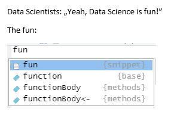

```{r setup, include=FALSE}
source("setup.R")
librarian::shelf(psych, meme)
knitr::opts_chunk$set(cache = FALSE)

knitr::opts_chunk$set(fig.width=7, fig.height=4.9)

modus <- function(x) {
  tab <- table(x)
  max_frequency <- max(table(x))
  modus <- as.numeric(names(tab[tab == max_frequency]))
  return(modus)
}

# todo: Daten randomisieren, so weit es geht:
# was geht nicht: mathe, geschlecht, abi, deutsch, 
# Lebenszufriedenheit, Vegetarier+Meditation
# abi - lebenszufriedenheit
# studium geschlecht
# sport, lebenszufriedenheit

# data <- read.csv("WS19.csv")
# data$abi <- as.numeric(paste(substr(data$abi, 1,1), ".", substr(data$abi, 3,3), sep = ""))
# data$geschlecht <- as.factor(data$geschlecht)
# data <- data[,-1]
# data$vegetarier <- data$vegetarier.
# data$vegetarier. <- NULL
# saveRDS(data, "data/ws19.rds")
# write.csv(data, "data.csv", row.names = FALSE)
# system("scp ~/programming/rkurs/WS19b.csv titz@login.tu-chemnitz.de:public_html/data.csv")
# vllt. auf rki umsteigen: https://npgeo-corona-npgeo-de.hub.arcgis.com/datasets/dd4580c810204019a7b8eb3e0b329dd6_0
data <- readRDS("data/students.rds")
# g <- as.character(data$geschlecht)
# data$geschlecht <- ifelse(g ==  "sonstiges", "divers", g)
# # data <- janitor::clean_names(data)
# saveRDS(data, "data/students.rds")
```

## Hinweise

Eine R-Nutzerin, die bereits vorher einen R-Kurs belegt hat, bewertete dieses Tutorial insgesamt mit einer Schwierigkeit von 5 (0=sehr leicht, 10=sehr schwer). Sie brauchte für dieses Tutorial ungefähr 1h 45min (ohne die letzte Übungsaufgabe). Klicke auf "Nächstes Kapitel" und es geht los.

## Einführung

Wie am Ende des zweiten Tages versprochen geht es nun mit richtiger Methodenlehre los. Wir werden heute und in den restlichen Sitzungen, Schritt für Schritt, alle statistischen Themen der Vorlesungen Methodenlehre I und II abhandeln. Los geht es mit deskriptiver Statistik. Als Datensatz benutzen wir eine Vorlesungsbefragung aus Methodenlehre I. Schauen wir uns die Daten mal grob an:

```{r echo = TRUE}
data <- readRDS("data/students.rds")
head(data)
library(psych)
describe(data)
```

## Tabellen

Machen wir erst mal eine einfache Tabelle für die Punkte im Matheabitur:

```{r tab1, echo = TRUE}
table(data$mathe)
```

Nun einige Erweiterungen. Tabelle nach Gruppenvariable:

```{r tab2, echo = TRUE}
table(data$mathe, data$geschlecht)
```

Relative Häufigkeiten gerundet:

```{r tab3, echo = TRUE}
round(proportions(table(data$mathe, data$geschlecht), 2), 2)
```

Ein kleiner Check: Beträgt die Summe dieser Tabelle 100%?

```{r tab3b, echo = TRUE}
sum(proportions(table(data$mathe, data$geschlecht)))
```

`proportions` selbst nimmt als Argument eine normale Tabelle, die wir vorher über `table` erzeugen. Das mag für Rohdaten etwas umständlich erscheinen, ist aber ganz praktisch, wenn wir von irgendwoher eine fertige Tabelle bekommen und dort die relativen Anteile wissen wollen:

```{r tab4, echo = TRUE}
irgendeine_tabelle <- matrix(c(10, 30, 14, 28), nrow = 2)
irgendeine_tabelle
```

```{r tab4b, echo = TRUE}
round(proportions(irgendeine_tabelle), 2)
```

Relative Häufigkeiten nach Spalten (gerundet):

```{r tab5, echo = TRUE}
round(proportions(table(data$mathe, data$geschlecht), margin = 2), 2)
```

`margin` bedeutet Rand, es kommt also an den Rand noch eine Zeile/Spalte hinzu, die die Daten zusammenfasst (in diesem Fall Randsummen oder Randanteile). Bei einer ANOVA-Tabelle machen wir so etwas ähnliches, benutzen jedoch Mittelwerte. Die 2 bei `margin` bedeutet Spalte (1 wäre die Zeile).

Okay. Dann probier Du es nun mal. Zeig mir die Häufigkeitsverteilung der Abiturnoten aufgeteilt nach dem Geschlecht:

```{r deskp1, exercise=TRUE}

```

```{r deskp1-solution}
table(data$abi, data$geschlecht)
```

```{r deskp1-mpc, echo=FALSE}
q_n(1, "Wie oft kommt die Note 1.0 bei Männern vor?")
```


Und nun das Gleiche mit relativen Häufigkeiten:

```{r deskp2, exercise=TRUE}

```

```{r deskp2-solution}
proportions(table(data$abi, data$geschlecht))
```

```{r deskp2-mpc, echo=FALSE}
q_n(0.009, "Welchen Anteil hat die Note 1.0 bei Männern? Runde auf 3 Dezimalstellen.")
```

Gib mir den relativen Anteil der Punkte in Deutsch nach dem Geschlecht aus. Die Summe über das Geschlecht soll in diesem Fall 100% ergeben. Zum Beispiel: für 6 Punkte, männlich 25%, weiblich 75%.

```{r deskp3, exercise=TRUE}

```

```{r deskp3-hint-1}
# Schau Dir die Befehle von oben an. Es gibt ein sehr ähnliches Beispiel.
```

```{r deskp3-hint-2}
# Benutze das Argument margin = 1 und rowSums, wenn Du die Randsummen nach der 
# Zeile bilden willst.
```

```{r deskp3-solution}
proportions(table(data$deutsch, data$geschlecht), margin = 1)
# Summe 100%?
rowSums(proportions(table(data$deutsch, data$geschlecht), margin = 1))
```

```{r deskp3-mpc, echo=FALSE}
q_n(.83, "Welchen Anteil bei der Punktzahl 12 haben die Frauen? (gerundet auf 2 Dezimalstellen)")
```

Man kann natürlich noch kompliziertere Tabellen mit mehr Variablen erzeugen, aber das wird schnell unübersichtlich und wird nur selten benötigt. Für eine Zusammenfassung von mehr als drei Variablen bieten sich eher Lage- und Streuungsmaße an.


## Lage- und Streuungsmaße

Die bekanntesten Lage- und Streuungsmaße kennst Du bereits aus Tag 2:

Mittelwert

```{r lage, echo = TRUE}
mean(data$abi)
```

Median

```{r lageb, echo = TRUE}
median(data$abi)
```

Standardabweichung

```{r lagec, echo = TRUE}
sd(data$abi)
```

Welche Maße sind sonst noch relevant in der Methodenlehre? Berechne mir vom Alter die Varianz, die Range, den mittleren absoluten Abstand, die Quantile 30% und 60%, sowie den Interquartilsabstand.

```{r lage1, exercise=TRUE}

```


```{r lage1-solution}
var(data$alter)
range(data$alter)
mad(data$alter)
quantile(data$alter, c(0.3, 0.6))
IQR(data$alter)
```


```{r lage1-mpc, echo=FALSE}
question("Welcher von den Streuungswerten ist am kleinsten?",
  answer("Mittlere absolute Abweichung (MAD)", correct = TRUE),
  answer("SD"),
  answer("Varianz"),
  answer("IQA"),
  answer("Range"),
  random_answer_order = T
)
```

Uns fehlt nur noch der Modus. Wie Du schon aus Tag 1 weißt, gibt es keine Funktion in `R` für den Modus (zumindest ohne Zusatzpakete). Wir werden uns jetzt eine eigene Funktion dafür schreiben. Das ist ein relativ fortgeschrittenes Thema, aber wir sind ja auch schon bei Tag 3. Konzentrier Dich gut, dann hast Du bald die Möglichkeit `R`  so zu erweitern, wie Du willst.

## Exkurs: Eigene Funktionen schreiben

Wir überlegen uns zunächst was die Funktion Modus leisten soll, welche Eingaben sie braucht und welche Ausgabe sie produziert.

Der Modus ist der häufigste Wert, also könnten wir die Funktion `table` benutzen 

```{r funk1, echo = TRUE}
table(data$alter)
```

und von dort den maximalen Wert auslesen:

```{r funk1b, echo = TRUE}
max(table(data$alter))
```

Das ist allerdings nicht der Wert selbst, sondern wie oft er vorkommt. Wir müssen jetzt also noch selektieren:

```{r funk2, echo = TRUE}
tab_alter <- table(data$alter)
max_frequency <- max(table(data$alter))
tab_alter[tab_alter == max_frequency]
```

Das scheint zu funktionieren. Als Output möchten wir nur den Wert und nicht die Häufigkeit:

```{r funk3, echo = TRUE}
tab_alter <- table(data$alter)
max_frequency <- max(table(data$alter))
names(tab_alter[tab_alter == max_frequency])
```

Das ganze noch als numerischen Wert:
```{r funk4, echo = TRUE}
tab_alter <- table(data$alter)
max_frequency <- max(table(data$alter))
as.numeric(names(tab_alter[tab_alter == max_frequency]))
```

Das sollte für unsere Zwecke reichen. Wie Du siehst, braucht man doch einige Operationen um so etwas simples wie den Modus auszurechnen. Wir möchten das Ganze nun in eine Funktion packen, denn so viele Operationen auszuführen ist sehr umständlich. Als Eingabe haben wir nur den Vektor von dem wir gerne den Modus hätten, die Ausgabe ist ein Skalar.

```{r function, echo = TRUE}
modus <- function(x) {
  tab <- table(x)
  max_frequency <- max(table(x))
  modus <- as.numeric(names(tab[tab == max_frequency]))
  return(modus)
}
modus(data$alter)
```

Wir erzeugen also eine Funktion indem wir einer Variablen den Wert `function` zuweisen. Die Funktion `function` hat eine spezielle Syntax. Sie beginnt mit Klammern `()`, die die Parameter der Funktion enthalten, in diesem Fall einfach einen Vektor mit dem Namen `x`. Du könntest auch eine andere Bezeichnung verwenden, wichtig ist aber, dass immer dort wo diese Variable gebraucht wird, Du den gleichen Namen benutzt (siehe Zeile 2 und 3, dort steht `x`). Probier es mal aus. Zunächst falsch: ändere `table(x)` zu `table(y)` und führe den Code nochmal aus.

```{r function1a, exercise=TRUE, exercise.eval=FALSE}
modus <- function(x) {
  tab <- table(____)
  max_frequency <- max(table(x))
  modus <- as.numeric(names(tab[tab == max_frequency]))
  return(modus)
}
modus(data$alter)
```

```{r function-mpc, echo=FALSE}
question("Welcher Fehler wird produziert?",
  answer("object 'y' not found", correct = TRUE),
  answer("wrong dimension"),
  answer("object 'x' not found"),
  answer("unexpected 'y' in table(y)"),
  answer("wrong number of arguments"),
  answer("unexpected 'x' in table(x)"),
  random_answer_order = T
)
```

Und jetzt ändere mal alle Vorkommnisse von `x` zu `y` in der Funktion. Klappt es nun?

```{r function1b, exercise=TRUE}
modus <- function(____) {
  tab <- table(____)
  max_frequency <- max(table(____))
  modus <- as.numeric(names(tab[tab == max_frequency]))
  return(modus)
}
modus(data$alter)
```

Nach den Parametern kommen geschweifte Klammern `{}`, die die Funktion definieren. Das sind die Befehle, die wir uns vorher überlegt haben, jedoch mit der Variable `x` statt `data$alter`, denn die Funktion soll ja allgemein gültig sein. Abschließend benutzen wir die Anweisung `return`, die den finalen Wert der Funktion zurückgibt. Man könnte auch einfach `modus` schreiben statt `return(modus)`, da die letzte Zeile bei `R` immer als Rückgabewert behandelt wird. Es ist aber sauberer `return` zu schreiben. Trotzdem, probier mal aus `return` zu entfernen und lass als letzte Zeile nur `modus` stehen. Das sollte zum gleichen Ergebnis führen.

```{r function1c, exercise=TRUE}
modus <- function(x) {
  tab <- table(x)
  max_frequency <- max(table(x))
  modus <- as.numeric(names(tab[tab == max_frequency]))
  ____
}
modus(data$alter)
```

Der Aufruf der gesamten Funktion läuft über den Namen, den wir der Funktion gegeben haben (`modus`) und die Parameter, die die Funktion hat, in diesem Fall nur einer (`x`). Wir können den Parameter beim Aufruf benennen, was etwas sauberer ist:

```{r function2, echo = TRUE}
modus(x = data$alter)
```

Falls wir das nicht tun, geht `R` davon aus, dass die übergebenen Parameter der Reihenfolge der Funktionsparameter entsprechen. Da wir hier nur einen Parameter haben, spielt das keine große Rolle. Probier es mal aus, entferne `x =` und schreib nur `modus(data$alter)`.

```{r function2b, exercise=TRUE}
modus(x = data$alter)
```

Funktionen wirken am Anfang sehr kompliziert. Im Grunde sind sie es aber nicht, denn Du musst nur die Syntax beachten. Jede Funktion hat einen Namen, sie hat Parameter, einen Rückgabewert und eine Definition.

Übung macht den Meister. Schreib eine eigene Funktion für die Berechnung des Mittelwerts. Benutze dafür die Funktionen `sum` und `length`. Berechne anschließend den Mittelwert für das Alter der Probanden, vergleiche ob Dein Ergebnis mit der Funktion `mean` übereinstimmt.

```{r funktion1, exercise=TRUE}

```

```{r funktion1-hint-1}
mw <- function(x){
  # und hier nun Dein Code
}
```

```{r funktion1-solution}
mw <- function(x){
  return(sum(x) / length(x))
}
mw(data$alter) == mean(data$alter)
```

```{r funktion1-mpc, echo=FALSE}
question("Welcher Code erzeugt die Funktion ``mw``, die den Mittelwert eines Vektors berechnet?  (mehrere Antworten sind richtig)",
  answer("mw <- function(x) {return(sum(x) / length(x))}", correct = TRUE),
  answer("mw <- function(x) {return(mean(x))}", correct = TRUE),
  answer("mw <- return(mean(x))"),
  answer("mw <- return(sum(x) / length(x))"),
  answer("mw <- function(x) {mean(y)}"),
  answer("mw <- mean(x)"),
  answer("mw <- mean", correct = TRUE),
  answer("mw <- function(x) {sum(x) / length(x))}", correct = TRUE),
  random_answer_order = T
)
```

Man hat hier also sehr viele Möglichkeiten, aber am saubersten ist es mit `return` zu arbeiten. Interessant ist `mw <- mean`, was einfach nur einen Alias für `mean` erzeugt. Wenn Dir also eine Funktion in R zu lang ist, kannst Du so ein Kürzel definieren.

Halte mal kurz inne. Du hast gerade eine eigene Funktion in `R` geschrieben. Du hast die Pforte der Allmächtigkeit geöffnet. Von nun an sagst Du `R` wie es mit Dir sprechen soll.

```{r machmal, echo = TRUE}
mach_mir_mal_den_mittelwert <- function(x) {
  return(mean(x))
}
mach_mir_mal_den_mittelwert(data$alter)
```

```{r machmalb, echo = TRUE}
und_jetzt_noch_die_varianz <- function(x){
  return(var(x))
}
und_jetzt_noch_die_varianz(data$alter)
```

Respekt! Wenn Funktionen schreiben mal nicht einen Heidenspaß macht...


{width=350}

Nun aber wieder zum Ernst des Lebens. Was hatten wir noch in Methodenlehre 1? Na klar, Abbildungen!

<!-- Achtung. Ich verwende hier ``na.rm = TRUE``. Wenn ich das nicht mache, bekomme ich einen Fehler. Warum? Weil manche Personen ihre Abiturnote nicht angegeben haben. Wie bekomme ich das heraus? Wir können uns eine Tabelle mit NA-Werten ausgeben lassen: -->

<!-- ```{r} -->
<!-- table(data$abi, useNA = "always") -->
<!-- ``` -->

## Einfache Abbildungen

Boxplot gefällig?

```{r bp, echo = TRUE}
boxplot(data$abi)
```

Oder doch lieber ein Stamm-Blatt-Diagramm?

```{r stem, echo = TRUE}
stem(data$abi)
```
 
Boxplot mit Gruppierung:

```{r bpgroup, echo = TRUE}
boxplot(data$abi ~ data$geschlecht)
```

Hier benutzen wir die Tilde `~`. Das ist ein spezielles Symbol in `R`, wir werden es uns später nochmal genauer anschauen. Merk Dir einfach, dass die Syntax der Idee folgt `AV ~ UV1 + UV2 + ... + UVn` (links steht die AV, rechts die UVs, getrennt durch die Tilde) -- bitte frag mich jetzt nicht wo die Tilde auf der Tastatur ist. Ein echter Programmierer weiß das intuitiv!

Histogramm:
```{r hist, echo = TRUE}
hist(data$abi)
```

Streudiagramm
```{r scatter, echo = TRUE}
plot(data$mathe, data$deutsch)
```

und dazu noch die Korrelation als Statistik:
 
```{r scatterb, echo = TRUE}
cor(data$mathe, data$deutsch)
```

Viele behaupten ja, dass man entweder gut in Deutsch oder Mathe ist. Dies ist offensichtlich nicht der Fall, denn die Korrelation zwischen beiden ist sehr hoch (wenn man den Messfehler berücksichtigt wäre die Korrelation noch deutlich höher). Aus Perspektive der meisten Intelligenztheorien ist dies ein zu erwartendes Resultat.

Unschön bei der Abbildung ist das Problem des Overplottings. Man sieht nicht, wenn mehrere Punkte aufeinanderliegen. Das lässt sich mit einem Sonnenblumendiagramm beheben:

```{r sun, exercise=T}
sunflowerplot(data$mathe, data$deutsch)
```

Oder mit Transparenz:
```{r transp, echo = TRUE}
plot(data$mathe, data$deutsch, pch = 20, col = rgb(red = 0, green = 0, blue = 1,
                                                   alpha = 0.15))
```

Was passiert hier? Wir machen einen Plot, der als Argument 1 die $x$-Achse aufnimmt, als Argument 2 die $y$-Achse. Dann übergeben wir noch `pch`, steht für plotting character. (Probier mal andere Zahlen aus!) Und schließlich noch über `col` die Farbe. Hierfür verwenden wir wiederum eine andere Funktion, `rgb`, und geben dort die Transparenz an. Probier für `alpha` andere Werte aus (zwischen 0 und 1).

Plots, die man heutzutage in den meisten Publikationen sieht, zeigen Mittelwerte und Standardfehler. Hierfür können wir das Hilfspaket `psych` benutzen. Dort gibt es die Funktion `error.bars`:
<!-- Nicht vergessen, wir müssen es vorab laden (und ggf. installieren). -->

```{r eye, exercise = TRUE, exercise.eval = TRUE}
error.bars(data[, c("mathe", "deutsch")], eyes = FALSE)
```

Das `eyes`-Argument kannst Du direkt mal ausprobieren. Setze es auf `TRUE`.

Die Abbildungen sehen schon ganz nett aus, aber noch bessere bekommt man mit dem Paket `ggplot2` hin. Wenn Du also nach diesem Kurs noch mehr willst, empfehle ich Dir dieses Paket zu studieren.

Jetzt bist Du erst mal dran. Ich befördere Dich zum Hilfswissenschaftler. Deine erste Aufgabe: Mach mir ein paar schöne Plots!

Bitte ein Boxplot der Lebenszufriedenheit (Variable `lebenszufriedenheit`):

```{r plot1, exercise=TRUE}

```

```{r plot1-solution}
boxplot(data$lebenszufriedenheit)
```


```{r plot1-mpc, echo=FALSE}
q_n(8, "Wo liegt der Median in Deinem Boxplot?")
```

Nun der gleiche Boxplot, aber gruppiert nach Vegetarier und Meditation:

```{r plot2, exercise=TRUE}

```

```{r plot2-hint-1}
# Syntax für boxplot ist: AV ~ UV1 + UV2
```

```{r plot2-solution}
boxplot(data$lebenszufriedenheit ~ data$vegetarier + data$meditation)
```

```{r plot2-mpc, echo=FALSE}
question("Welche Gruppe hat den niedrigsten Median in Lebenszufriedenheit?",
  answer("Fleischessende nicht-Meditierer", correct = TRUE),
  answer("vegetarische nicht-Meditierer"),
  answer("vegeatrische Meditierer"),
  answer("Fleischessende Meditierer"),
  answer("alle Mediane sind gleich"),
  random_answer_order = T
)
```

Nun bitte noch ein Stamm-Blatt-Diagramm für die Körpergröße (Variable `groesse`):

```{r plot3, exercise=TRUE}

```

```{r plot3-solution}
stem(data$groesse)
```

```{r plot3-mpc, echo=FALSE}
question("Was ist der kleinste Wert?",
  answer("100", correct = TRUE),
  answer("160"),
  answer("150"),
  answer("155"),
  answer("165"),
  random_answer_order = T
)
```

Da hat sich wohl jemand einen Spaß erlaubt.

Jetzt noch ein Histogramm für Körpergröße:

```{r plot4, exercise=TRUE}

```

```{r plot4-solution}
hist(data$groesse)
```

```{r plot4-mpc, echo=FALSE}
question("Welche Körpergröße kommt am häufigsten vor?",
  answer("160-170", correct = TRUE),
  answer("170-180"),
  answer("150-160"),
  answer("160"),
  answer("170"),
  random_answer_order = T
)
```

Nun einen Scatterplot der Abi-Note gegen die Lebenszufriedenheit (beim Abi sind niedrige Werte gut, bei der Lebenszufriedenheit sind hohe Werte gut):

```{r plot5, exercise=TRUE}

```

```{r plot5-solution}
plot(data$abi ~ data$lebenszufriedenheit)
```

```{r plot5-mpc, echo=FALSE}
question("Welcher Zusammenhang ist zu erkennen?",
  answer("Die Lebenszufriedenheit ist leicht negativ korreliert mit einer guten Abinote.", correct = TRUE),
  answer("Die Lebenszufriedenheit ist leicht positiv korreliert mit einer guten Abinote."),
  answer("Die Lebenszufriedenheit ist stark negativ korreliert mit einer guten Abinote."),
  answer("Die Lebenszufriedenheit ist stark positiv korreliert mit einer guten Abinote."),
  random_answer_order = T
)
```

Beseitige das Problem des Overplottings (in der letzten Abbildung) mit Hilfe eines Sonnenblumendiagramms oder der Einführung von Transparenz.

```{r plot6, exercise=TRUE}

```

```{r plot6-solution}
sunflowerplot(data$abi ~ data$lebenszufriedenheit)
# oder
plot(data$abi ~ data$lebenszufriedenheit, pch = 20,
     col = rgb(red = 0, green = 0, blue = 1, alpha = 0.15))
```


```{r plot6-mpc, echo=FALSE}
q_n(8, "Bei welchem Wert der Lebenszufriedenheit gibt es das meiste Overplotting?")
```

Gut, nun noch die Korrelation zwischen Lebenszufriedenheit und der Abiturnote:

```{r corr, exercise=TRUE}

```

```{r corr-solution}
cor(data$abi, data$lebenszufriedenheit)
# für die nächste Aufgabe musst Du dann die Korrelation quadrieren, damit
# Du auf die Varianzaufklärung kommst! r²
```


```{r corr-mpc, echo=FALSE}
q_n(17, "Wie groß ist die aufgeklärte *Varianz* in der Lebenszufriedenheit durch die Abiturnote? (in Prozent auf eine ganze Zahl gerundet)")
```

Zum Abschluss hätte ich gerne noch die Mittelwerte und das 68%-Konfidenzintervall für das Mögen von Hunden und Katzen (Variablen `hunde_m` und `katzen_m`). Nutze hier für die Funktion `error.bars` aus dem `psych` Paket und den Parameter `alpha` (Achtung: Alpha ist nicht das Konfidenzniveau!).

```{r plot7, exercise=TRUE}

```

```{r plot7-solution}
error.bars(data[, c("hunde_m", "katzen_m")], alpha = .32, eyes = FALSE)
```

```{r plot7-mpc, echo=FALSE}
question("Wie groß ist der Standardfehler ungefähr?",
  answer("kleiner 0.5", correct = TRUE),
  answer("zwischen 0.5 und 1"),
  answer("zwischen 1 und 2"),
  answer("größer als 2"),
  answer("Aus der Abbildung lässt sich der Standardfehler nicht abschätzen."),
  random_answer_order = T
)
```

Sehr gute Arbeit! Deine Bezahlung erhältst Du natürlich nicht in € sondern in Rfahrungspunkten.

Viel mehr wollen wir heute gar nicht machen, denn gute Abbildungen zu erstellen, ist schon ziemlich aufwändig. Falls Du das nicht so siehst, kommen in den Übungsaufgaben für Tag 3 noch einige Challenges auf Dich zu.

## Übungsaufgaben Tag 3

Programmiere eine eigene Funktion, die eine Variable $z$-standardisiert. Wende Sie anschließend auf die Mathe- und Deutschnote an. Multipliziere schließlich alle $z$-Werte der Mathe- und Deutschpunkte, summiere alle Wert auf und teile durch die Stichprobengröße (109).

```{r test, exercise=TRUE}

```

```{r test-hint-1}
zstandardisere <- function(x){
  (x - mean(x)) / sd(x)
}
```

```{r test-solution}
zstandardisiere <- function(x){
  (x - mean(x)) / sd(x)
}
sum(zstandardisiere(data$mathe) * zstandardisiere(data$deutsch)) / 109
```

```{r test-mpc, echo=FALSE}
question("Was hast Du gerne berechnet?",
  answer("Die Korrelation zwischen Mathe- und Deutschpunkten.", correct = TRUE),
  answer("Die Kovariation zwischen Mathe- und Deutschpunkten"),
  answer("Die Kovarianz zwischen Mathe- und Deutschpunkten"),
  answer("Die Kolinearität zwischen Mathe- und Deutschpunkten"),
  random_answer_order = T
)
```

Erstelle eine Kreuztabelle zu den Variablen Studium und Geschlecht. Die Tabelle soll die relative Häufigkeit angeben und auf 2 Dezimalstellen gerundet sein. Falls Du nicht weißt wie man rundet, finde es durch eine Websuche heraus.

```{r tab, exercise=TRUE}

```

```{r tab-solution}
round(proportions(table(data$studium, data$geschlecht)), 2)
```

```{r tab-mpc, echo=FALSE}
q_n(13, "Welchen Anteil haben männliche Psychologie-Studierende an allen Studierenden in der Stichprobe? Angabe in Prozent auf eine ganze Zahl gerundet.")
```

Die Varianz die `R` über `var` berechnet ist die geschätzte Populationsvarianz (im Nenner steht $n-1$). Schreib eine Funktion, die die Stichprobenvarianz berechnet (im Nenner steht $n$). Vergleiche anschließend die absolute Abweichung der beiden Funktionen für die Variable Alter.

```{r var, exercise=TRUE}

```

```{r var-solution}
var_stichprobe <- function(x){
  sum((x - mean(x))^2) / length(x)
}
var(data$alter) - var_stichprobe(data$alter)
```

```{r var-mpc, echo=FALSE}
q_n(0.15, "Wie groß ist die absolute Abweichung zwischen beiden Schätzungen. Runde auf 2 Dezimalstellen.")
```

Spielen wir nun ein Spiel. Ich zeige Dir eine Abbildung und Du baust sie nach. Du musst in diesem Fall selbst nachprüfen ob Du alles richtig gemacht hast. Achte auf die Details!

### Abbildung 1

```{r echo=FALSE}
plot(data$sport, data$lebenszufriedenheit, pch = 18, col = rgb(0, 0, 1, 0.15),
     xlab = "Sport", ylab = "Lebenszufriedenheit", main = "Abbildung 1")
text(9, 3, "r = 0.21")
```

Nun Du. Wenn Du nicht weiter weist, dann mache eine Websuche und finde die notwendigen Parameter.

```{r bauen1, exercise=TRUE}

```

```{r bauen1-solution}
plot(data$sport, data$lebenszufriedenheit, pch = 18, col = rgb(0, 0, 1, 0.15),
     xlab = "Sport", ylab = "Lebenszufriedenheit", main = "Abbildung 1")
text(9, 3, "r = 0.21")
```

### Abbildung 2

```{r echo=FALSE}
plot(density(data$alter), main = "Dichtefunktion für Alter")
```

Nun Du. Wenn Du nicht weiter kommst, mache eine Websuche für "kernel density plot in R".

```{r bauen2, exercise=TRUE}

```

```{r bauen2-solution}
plot(density(data$alter), main = "Dichtefunktion für Alter")
```

### Abbildung 3

```{r echo=FALSE}
pairs(data[,4:8], pch = 20, col = rgb(0, 0, 1, alpha = .15))
```

Nun Du. Wenn Du nicht weiter kommst, mache eine Websuche für "scatter plot matrices in R".

```{r bauen3, exercise=TRUE}

```

```{r bauen3-solution}
pairs(data[,4:8], pch = 20, col = rgb(0, 0, 1, alpha = .15))
```

### Abbildung 4

Okay, und jetzt mal eine richtige Herausforderung!

```{r echo=FALSE}
# plot(meme_text_bottom(meme_text_top(meme_get("SuccessKid"), "Finally,"),
#                  "solved the last exercise \nof this stupid R day!"))
# plot(meme_text_bottom(meme_text_top(meme_get("OneDoesNotSimply"), "ONE DOES NOT SIMPLY"), "SOLVE THIS EXERCISE"))
u <- "data/mordor.png"
meme(u, "ONE DOES NOT SIMPLY", "SOLVE THIS EXERCISE!", font  = "Times", size = 3)
```

Hierfür bekommst Du aber keinen Tipp, außer, dass es wirklich geht und dass es mehrere Lösungen gibt. Da man in diesem Tutorial keine externen Pakete (für alternative Lösungen) installieren kann, darfst Du diese Aufgabe auch lokal lösen (außerhalb des Browsers), schick mir dann zur Prüfung einfach den R-Code per Mail an halloffame at rlernen.de

```{r meme, exercise=TRUE}

```

```{r meme-hint-1}
# schau nochmal, was so im data-Ordner liegt und finde heraus welche Pakete 
# geladen sind, dann siehst Du nämlich welches Paket ich benutzt habe...
```

```{r meme-solution}
# So einfach wird das nicht! Aber wenn Du die Lösung wirklich hast, kannst Du 
# sie mir schicken (halloffame at rlernen.de) und wenn sie stimmt, liste ich Dich 
# in der Hall of Fame!
```

Bisher haben die letzte Aufgabe nur zwei Personen geschafft

**HALL OF FAME: Aline Mangold, Victoria Nöther**
